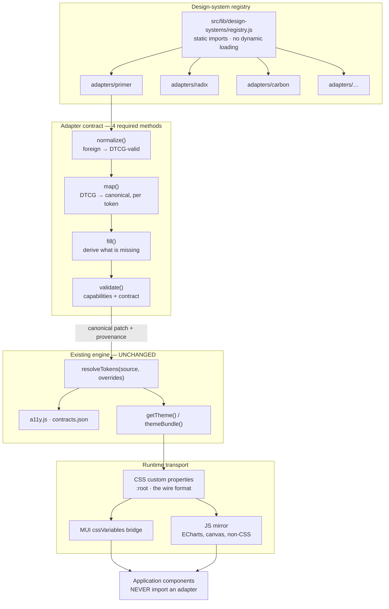
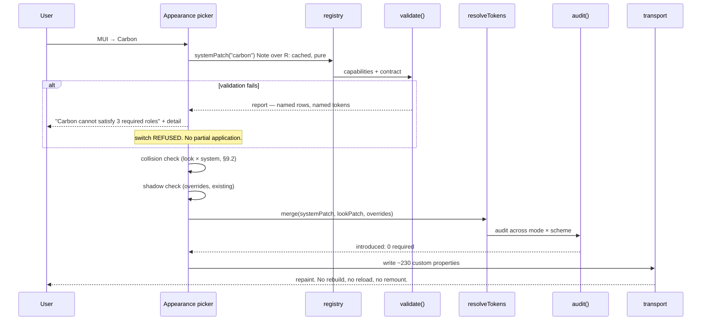

# Multi-design-system adapters — architecture proposal

> How to let a user pick a design system from a dropdown and have the product's visual
> language change, without coupling a single application component to any of them.
>
> Builds on [design-system.md](design-system.md) (what exists today),
> [design-system-presets-research.md](design-system-presets-research.md) (the evidence),
> and [looks-workplan.md](looks-workplan.md) (what is built and what is not).

**Labels used throughout:** **[V]** verified from a primary source · **[R]** reasoned
recommendation · **[A]** assumption or open question. Mappings are labelled **Exact**,
**Derived**, **Approximate**, or **Unsupported**.

---

## 1. Executive recommendation

### 1.1 The architecture is cheaper than it looks — because it already exists

The single most important finding: **an adapter's output is a Look patch.**

A Look is already a sparse override patch over the canonical source, merged by
`resolveTokens(source, overrides)`, gated by `contracts.json`, and composed under the
user's own edits. A design-system adapter has exactly the same job — produce canonical
token values from a foreign vocabulary — and can therefore reuse **the entire existing
pipeline**: no new resolver, no new audit engine, no new theme construction, no new
persistence.

```
DesignSystemAdapter.resolveTokens()  →  canonical patch  →  the pipeline that already runs
```

What genuinely has to be built is an `adapters/` directory, a registry, a capability
model, a provenance/fallback chain, and the CSS-variable transport. **Not** a second
token engine.

### 1.2 Two hard scope corrections

**Correction 1 — this is a design *language* adapter, not a design *system* swap. [R, High]**

Tokens carry colour, type, scale, shape, depth and motion. They do not carry **component
anatomy**. Carbon's Button is 32px tall with a 4px asymmetric focus ring and a
left-aligned label at a specific optical offset; Polaris's Button has different padding
logic and a different disabled treatment; Spectrum's has a different focus model
entirely. No token value produces those differences, because they are structural.

So "switch to Carbon" honestly means **"the product adopts Carbon's visual language"**,
not "the product now uses Carbon". Anything more requires swapping the component library,
which means an abstraction layer over 16 components × 5 variants × 5 states in every
target library — a different project, an order of magnitude larger, and explicitly out of
scope here. **The dropdown must be labelled to match what it does**, or it promises
something the architecture cannot deliver.

**Correction 2 — four of the thirteen cannot ship as named options.**

| System | Status | Reason |
|---|---|---|
| **Shopify Polaris** | 🚫 **Blocked** | **[V]** Modified MIT restricting use to applications that integrate or interoperate with Shopify software or services. We are neither |
| **Nord Design System** | 🚫 **Blocked** | **[V]** *"solely meant for building digital products and experiences for Nordhealth"* — same class of restriction as Polaris |
| **Vercel / Geist** | ⚠️ **No primary source** | **[V]** Vercel publishes the Geist *fonts* openly. I found **no official Vercel-published token package.** Every token list I could find is a third-party reverse-engineering of Vercel's brand. Shipping it means shipping someone's guess at another company's identity |
| **MUI** | ⚠️ **Category error** | MUI is our *runtime*, not a visual language we adopt. It belongs in the list as "Standard / our own", not as a peer of Carbon |

Beyond licence text, **no permissive licence grants trademark rights** — Apache-2.0 says
so explicitly in §6. A tenant-facing dropdown reading "Material", "Carbon", "Spectrum"
is a branding decision needing legal sign-off, not an engineering one. **This makes the
still-open §5.1 question (internal tool vs tenant-facing branding) load-bearing:** internal
and named is defensible with attribution; tenant-facing and named is not, without advice.

### 1.3 What I actually recommend

> **Build the adapter architecture. Ship it with eight systems, not thirteen. Name the
> proof of concept Primer, and run a half-day shadcn smoke test before it.**

Ship: **Standard (ours)** · **Primer** · **Radix Themes** · **shadcn/ui** · **Carbon** ·
**Ant Design** · **Chakra** · **Atlassian**¹ · **Spectrum 2**¹
— ¹ pending licence verification.
Drop: Polaris, Nord, Vercel. Reclassify MUI as "Standard".

---

## 2. Target architecture



**The invariant:** application components import from the theme and the token vocabulary.
They never import an adapter, never branch on the active design system, and never know
one exists.

---

## 3. Canonical token contract

**Deliberately the contract we already have**, formalised as types and extended with
provenance. Not a redesign. **[R, High]**

```ts
// src/lib/design-systems/contract.d.ts

/* ── provenance — the mechanism that forbids silent substitution ─────────── */

export type Confidence =
  | "exact"        // the system states this value for this role
  | "derived"      // computed from what it gave us, by a declared derivation
  | "approximate"  // nearest available; the systems disagree on meaning
  | "fallback"     // our Standard value; the system had nothing
  | "unsupported"; // the system has no concept here. NEVER given a value.

export interface Provenanced<T> {
  value: T | null;                 // null iff confidence === "unsupported"
  confidence: Confidence;
  from?: string;                   // the foreign token name, e.g. "fgColor.muted"
  note?: string;                   // required when confidence !== "exact"
}

/* ── tier 1 · primitives ─────────────────────────────────────────────────── */

export type Ramp = Record<"50"|"100"|"200"|"300"|"400"|"500"|"600"|"700"|"800"|"900"|"950", string>;

export interface CanonicalPrimitives {
  neutral: Ramp;
  brand: Ramp;                     // the accent the `scheme` axis varies
  success: Ramp; warning: Ramp; danger: Ramp; info: Ramp;
  white: string; black: string;
}

/* ── tier 2 · the 29 semantic roles ──────────────────────────────────────── */

export type SurfaceRole = "canvas" | "base" | "raised" | "subtle" | "overlay";
export type TextRole    = "primary" | "secondary" | "tertiary" | "disabled" | "on-brand";
export type BorderRole  = "default" | "subtle" | "strong";
export type ActionRole  = "rest" | "hover" | "pressed" | "indicator";
export type StatusRole  = "success" | "warning" | "danger" | "info";

export interface CanonicalSemantic {
  surface: Record<SurfaceRole, ModePair>;
  text:    Record<TextRole, ModePair>;
  border:  Record<BorderRole, ModePair>;
  action:  { primary: Record<ActionRole, ModePair>;
             accent:  Record<Exclude<ActionRole,"indicator">, ModePair> };
  focus:   { ring: ModePair };
  status:  Record<StatusRole, { foreground: ModePair; background: ModePair }>;
}

/** Light and dark are BOTH required. A system with no dark mode declares it in
 *  capabilities and the adapter derives one — it does not omit the key. */
export interface ModePair { light: string; dark: string }

/* ── scale ───────────────────────────────────────────────────────────────── */

export interface CanonicalScale {
  spacing: Record<"0"|"1"|"2"|"3"|"4"|"5"|"6"|"8"|"10"|"12"|"16", number>;
  radius:  Record<"none"|"sharp"|"control"|"surface"|"large"|"xl"|"pill", number>;
  shadow:  Record<"none"|"xs"|"sm"|"md"|"lg", ShadowValue>;
  motion:  { fast: number; medium: number; slow: number; easing: string };
  layout:  Record<string, number>;
}

export interface ShadowValue {
  offsetY: number; blur: number; spread: number;
  color: string; alpha: number;
  /** Declared, never derived — a shadow is a shortfall of light, and the same
   *  level needs a very different alpha on a dark surface. */
  darkAlpha: number;
}

/* ── typography ──────────────────────────────────────────────────────────── */

export type TypeStyleId =
  | "display/xl" | "heading/2" | "heading/3" | "title/l" | "title/m"
  | "body/l" | "body/m" | "body/s"
  | "label/l" | "label/m" | "label/s" | "data/mono";

export interface CanonicalTypography {
  families: { sans: string; mono: string; serif?: string };
  styles: Record<TypeStyleId, {
    size: number; weight: number; lineHeight: number; tracking?: number;
  }>;
}

/* ── tier 3 · component slots ────────────────────────────────────────────── */

export type InteractionState = "rest" | "hover" | "pressed" | "focus" | "disabled" | "selected";
export type SlotName = "bg" | "fg" | "border" | "ring" | "radius" | "padding" | "minHeight" | "type" | "gap";

export interface ComponentContract {
  base: Partial<Record<SlotName, string>>;      // canonical refs: {sem:…} {space:…} …
  variants: Record<string, {
    states: Partial<Record<InteractionState, Partial<Record<SlotName, string>>>>;
  }>;
  /** Rendered pairs. A slot with no pair is UNCHECKED, and unchecked reads
   *  exactly like compliant. Adding a pair is part of adding a slot. */
  pairs: Array<{ fg: string; bg: string; kind: "text"|"ui"|"decorative"; typeToken?: TypeStyleId }>;
}

/* ── the whole thing ─────────────────────────────────────────────────────── */

export interface CanonicalTokens {
  primitives: CanonicalPrimitives;
  semantic: CanonicalSemantic;
  typography: CanonicalTypography;
  scale: CanonicalScale;
  components: Record<string, ComponentContract>;
}

/** What an adapter actually returns — a sparse patch, every leaf provenanced. */
export type CanonicalPatch = DeepPartial<Provenance<CanonicalTokens>>;
```

**Component slots are adapter-writable in principle and locked by default. [R, High]**
The `look` axis may not write tier 3, because a Look that restyled a component would
break the rule that tier 3 follows tier 2. An adapter has the same restriction for the
same reason, with one exception: a declared `componentOverrides` block, listed in the
adapter manifest, gated by the contract, and shown in the import report.

---

## 4. Adapter interface

```ts
export interface DesignSystemAdapter {
  /* ── identity ─────────────────────────────────────────────────────────── */
  readonly id: string;                    // "primer"
  readonly name: string;                  // "Primer"
  readonly version: string;               // adapter semver, NOT upstream's
  readonly metadata: {
    upstreamVersion: string;
    source: string;                       // package or URL the values came from
    licence: string | null;               // SPDX id; null means unlicensed → refuse
    attribution: string | null;           // rendered in the UI when licence is non-null
    extractedOn: string;
  };

  readonly capabilities: Capabilities;    // REQUIRED — see §6

  /* ── REQUIRED: the four that do the work ──────────────────────────────── */
  normalize(raw: unknown): { tokens: DtcgDocument; warnings: string[] };
  map(doc: DtcgDocument): { patch: CanonicalPatch; unmapped: Record<string, unknown> };
  fill(patch: CanonicalPatch): { patch: CanonicalPatch; derived: string[] };
  validate(patch: CanonicalPatch): ValidationReport;

  /* ── OPTIONAL: refinements. Omitting one is legal and means "use fill()". ─ */
  getColorSystem?(): ColorSystemHints;    // e.g. "steps 11/12 are the text steps"
  getTypography?(): Partial<CanonicalTypography>;
  getSpacing?(): Partial<CanonicalScale["spacing"]>;
  getRadius?(): Partial<CanonicalScale["radius"]>;
  getElevation?(): Partial<CanonicalScale["shadow"]>;
  getMotion?(): Partial<CanonicalScale["motion"]>;
  getComponentMapping?(): Record<string, Partial<ComponentContract>>;

  /* ── DELIBERATELY ABSENT ──────────────────────────────────────────────────
     createTheme() is NOT part of this interface.

     An adapter that builds its own theme object owns the runtime, and then two
     adapters own it differently and the audit can only score one of them. The
     adapter's entire output is a canonical patch; `getTheme()` stays the single
     theme constructor. This is the one place the proposed interface in the brief
     should be refused.                                                        */
}
```

| Method | Required | Why |
|---|---|---|
| `normalize` | ✅ | Foreign format → DTCG. Isolates parsing from meaning |
| `map` | ✅ | **The only genuinely per-system code.** Where judgement lives |
| `fill` | ✅ | Gap-filling via declared derivations only |
| `validate` | ✅ | No adapter ships unvalidated |
| `capabilities` | ✅ | Drives the UI; absence would mean inventing support |
| `get*` | ⬜ | Refinements. Absent → `fill()` handles it |
| `createTheme` | ❌ | **Refused.** See above |

### 4.1 Why `map()` cannot be generalised **[V, High]**

DTCG 2025.10 standardises **syntax and deliberately not semantics.** There is no
normative vocabulary of roles. Two perfectly valid files can share zero role names, and
every "token translation" tool in the industry (Style Dictionary, `sd-transforms`,
Terrazzo) translates *format and platform*, never *meaning*.

The consequence, which decides the roadmap:

```
SCALE-POSITIONAL                     ROLE-NAMED
Radix (12 steps, documented)         Primer, Carbon, Atlassian,
Tailwind/shadcn (50–950)             Spectrum, Chakra, Ant
        │                                    │
   map() is a LOOKUP TABLE            map() is a NEGOTIATION
   written once, correct for          argued per token,
   every scale the system ships       per system, forever
```

Radix step 11 *is* "low-contrast text" — published, so it decodes. Carbon's `$layer-01`
is a nesting depth, not an elevation, and somebody must decide whether it is our
`surface/raised` or `surface/subtle`, while `$text-helper` has no destination at all.
**Adding a system is cheap for positional, expensive for role-named, and most famous
design systems are role-named.**

---

## 5. Design-system registry

Static imports. No dynamic loading, no remote fetch, no `if/else` anywhere. **[R, High]**

```js
// src/lib/design-systems/registry.js
import standard from "./adapters/standard/index.js";
import primer   from "./adapters/primer/index.js";
import radix    from "./adapters/radix/index.js";
// … one line per adapter. This file is the ONLY place that names them.

const ALL = [standard, primer, radix, /* … */];

for (const a of ALL) assertAdapterShape(a);   // fail at boot, not at click

export const DESIGN_SYSTEMS = ALL.filter((a) => a.metadata.licence !== null);
export const BY_ID = Object.fromEntries(DESIGN_SYSTEMS.map((a) => [a.id, a]));
export const DEFAULT_SYSTEM = "standard";

export const adapterFor = (id) => BY_ID[id] ?? BY_ID[DEFAULT_SYSTEM];
export const capabilitiesOf = (id) => adapterFor(id).capabilities;

/** The patch, built once per (adapter, version) and cached. Pure. */
export const systemPatch = (id) => memo(id, () => {
  const a = adapterFor(id);
  const { tokens }   = a.normalize(a.raw);
  const { patch }    = a.map(tokens);
  const { patch: f } = a.fill(patch);
  const report       = a.validate(f);
  if (!report.ok) throw new AdapterError(a.id, report);   // never ships broken
  return { patch: f, report };
});
```

**Adding a system = create a folder, add one import line.** The core engine never learns
its name. An adapter with `licence: null` is filtered out of the registry rather than
being offered and failing later.

---

## 6. Capability matrix

Capabilities exist so the UI can say **"Not supported"** instead of inventing a mapping.

```ts
export interface Capabilities {
  colorPrimitives: boolean; semanticColor: boolean; darkMode: boolean;
  typographyScale: boolean; typefaces: boolean;
  spacingScale: boolean; radiusScale: boolean; elevation: boolean; motion: boolean;
  componentTokens: boolean; interactionStates: boolean;
  cssVariables: boolean; runtimeThemeSwitch: boolean;
  density: boolean; rtl: boolean; highContrast: boolean;
  /** Published contrast guarantee, not merely "we thought about it". */
  contrastGuarantee: "structural" | "documented" | "none";
}
```

| System | Colour | Dark | Type | Spacing | Radius | Elev. | Motion | Comp. tokens | CSS vars | Contrast guarantee |
|---|---|---|---|---|---|---|---|---|---|---|
| **Standard (ours)** | ✅ | ✅ | ✅ | ✅ | ✅ | ✅ | ✅ | ✅ 292 slots | ⚠️ emitted, unused | **structural** (gated) |
| **Primer** | ✅ **[V]** | ✅ 8 themes **[V]** | ✅ | ✅ | ✅ | ✅ | ✅ **[V]** | ❌ | ✅ **[V]** | documented |
| **Radix Themes** | ✅ **[V]** | ✅ **[V]** | ⚠️ limited | ❌ | ✅ | ❌ | ❌ | ❌ | ✅ | **structural** (APCA Lc 60/90) **[V]** |
| **shadcn/ui** | ✅ **[V]** | ✅ **[V]** | ❌ | ❌ | ✅ | ❌ | ❌ | ❌ | ✅ **[V]** | none |
| **Carbon** | ✅ **[V]** | ✅ 4 themes **[V]** | ✅ | ✅ | ⚠️ minimal | ⚠️ layer model **[V]** | ✅ | ⚠️ partial | ✅ | documented |
| **Ant Design** | ✅ **[V]** | ✅ algorithm **[V]** | ✅ | ✅ | ✅ | ✅ | ✅ | ✅ **[V]** | ⚠️ CSS-in-JS | none |
| **Chakra v3** | ✅ **[V]** | ✅ **[V]** | ✅ | ✅ | ✅ | ✅ | ✅ | ✅ recipes | ✅ always **[V]** | none |
| **Atlassian** | ✅ **[V]** | ✅ **[V]** | ✅ | ✅ | ✅ | ✅ | ⚠️ | ✅ | ✅ | documented (emphasis ladder) **[V]** |
| **Spectrum 2** | ✅ | ✅ 3 **[V]** | ✅ | ✅ | ✅ | ✅ | ✅ | ✅ **[V]** | ⚠️ | documented (Leonardo) **[V]** |
| **Material 3** | ✅ | ✅ ×3 contrast **[V]** | ✅ | ✅ | ✅ | ✅ | ✅ | ✅ | ✅ | **structural** (Δtone 40⇒3:1, 50⇒4.5:1) **[V]** |
| ~~Polaris~~ | 🚫 licence **[V]** | | | | | | | | | |
| ~~Nord~~ | 🚫 licence **[V]** | | | | | | | | | |
| ~~Vercel~~ | ⚠️ no primary token source **[V]** | | | | | | | | | |

**The point of this table is the ❌ column.** Selecting Radix must grey out the
typography, spacing and elevation editors with *"Radix Themes does not define these —
Standard values are in use"*, not silently invent them.

---

## 7. Token mapping matrix

| System | Colour model | Semantic style | Type | Spacing | Radius | Elevation | Difficulty | Key limitation |
|---|---|---|---|---|---|---|---|---|
| **Primer** | Per-theme functional over base **[V]** | Role-named, 2 tiers | **Exact** | **Exact** | **Derived** | **Derived** | **Low** | No component tier |
| **Radix Themes** | 12-step + alpha + P3 **[V]** | **Positional, documented** | **Approximate** | **Unsupported** | Exact | **Unsupported** | **Lowest** | Colour-led; most categories absent |
| **shadcn/ui** | ~30 OKLCH vars **[V]** | Role-named, flat | **Unsupported** | **Unsupported** | Exact | **Unsupported** | **Trivial** | Shallow — proves the pipeline, not the depth |
| **Carbon** | Role tokens per theme, ~200 **[V]** | Role-named, **layered** | Exact | Exact | Approximate | **Approximate** | **High** | `$layer-01/02/03` is nesting depth, not elevation; `$text-helper` has no home; ~85% discarded |
| **Ant Design** | **Seed → Map → Alias, algorithmic** **[V]** | Role-named | Exact | Derived | Exact | Exact | **Medium** | Values are *computed by their algorithm*; we must run it or re-implement it |
| **Chakra v3** | Core + semantic, Panda engine **[V]** | Role-named | Exact | Exact | Exact | Exact | **Medium** | 7 semantic tokens per palette **[V]** — a different slicing from our 29 roles |
| **Atlassian** | Role + **emphasis** + state **[V]** | Role-named, laddered | Exact | Exact | Exact | Exact | **Medium** | Emphasis ladder (subtlest→boldest) is finer than ours; collapsing it loses information |
| **Spectrum 2** | Platform-scaled sets **[V]** | Role-named | Exact | **Approximate** | Exact | Exact | **Medium-high** | Desktop/mobile scale is an axis we do not have |
| **Material 3** | HCT tonal palettes **[V]** | Role-named, container-led | Exact | Derived | Exact | **Approximate** | **Medium** | `*-container` roles have no counterpart; tonal elevation ≠ shadow |

### 7.1 A worked mapping — Radix Themes → canonical **[V on step semantics, R on assignment]**

`slate` as neutral, `blue` as brand, light mode:

| Radix | Published intent **[V]** | Canonical | Label |
|---|---|---|---|
| `slate.1` | App background | `surface/canvas` | **Exact** |
| `slate.2` | Subtle component bg | `surface/subtle` | **Exact** |
| *(white)* | — | `surface/raised` | **Derived** — Radix recommends white for raised in light |
| `slate.6` | Subtle border, non-interactive | `border/subtle` | **Exact** |
| `slate.7` | Interactive border | `border/default` | **Exact** |
| `slate.8` | Strong border, focus ring | `border/strong` | **Exact** |
| `slate.11` | Low-contrast text · **Lc 60 guaranteed** | `text/secondary` | **Exact** |
| `slate.12` | High-contrast text · **Lc 90 guaranteed** | `text/primary` | **Exact** |
| `blue.9` | Solid bg, highest chroma | `action/primary/rest` | **Exact** |
| `blue.10` | Hover over 9 | `action/primary/hover` | **Exact** |
| `blue.8` | Focus ring | `focus/ring` | **Exact** |
| *(none)* | — | `action/primary/pressed` | **Derived** — `adjust −6% L` from step 10 |
| *(none)* | — | `text/on-brand` | **Derived** — `best-contrast` vs `blue.9`, min 4.5 |
| *(none)* | — | `action/primary/indicator` | **Derived** — first step clearing 3:1 vs surface |
| `slate.4`/`.5` | Component hover/pressed bg | *(tier-2 has no home)* | **Approximate** → tier 3 |
| `*A` alpha scales | Alpha variants **[V]** | `{mix:a,b,pct}` | **Exact** — maps onto machinery we already have |
| `*P3` scales | Wide gamut **[V]** | — | **Unsupported** — preserved in `unmapped`; we are sRGB |
| — | — | typography, spacing, elevation | **Unsupported** — capability `false`, editors greyed |

**~20 exact, ~6 derived, 0 orphaned, 3 whole categories honestly unsupported.**

### 7.2 The counter-example — Carbon → canonical **[V on names, R on analysis]**

| Carbon | Canonical | Label | Problem |
|---|---|---|---|
| `$background` | `surface/canvas` | **Exact** | — |
| `$layer-01` | `surface/raised`? `subtle`? | **Approximate** | Carbon layers by **nesting depth**, we layer by **elevation intent**. Different ideas |
| `$layer-02`, `$layer-03` | — | **Unsupported** | We have 5 surfaces; they have a recursive model with interaction variants per level |
| `$text-primary` | `text/primary` | **Exact** | Same name — which does **not** mean the same luminance intent |
| `$text-helper` | — | **Unsupported** | Nearest is `text/tertiary`, which is not what helper text means |
| `$text-on-color` | `text/on-brand` | **Approximate** | Theirs is fixed, **ours is derived** — ours must win or we reintroduce the 15-of-18 defect |
| `$interactive` | `action/primary/rest`? | **Approximate** | Their "interactive" is an accent, not necessarily a button fill |
| ~200 tokens **[V]** | 29 roles | — | **~85% discarded** |

The honest UI for this is **an import report**, not a preset card.

---

## 8. Component mapping strategy

### 8.1 The canonical component contract

We already have 292 slots across 16 components. The brief lists 18; here is the true
overlap. **[V from the repo]**

| Canonical component | Exists | Notes |
|---|---|---|
| Button, Input, Tabs (`tab`), Dialog, Drawer, Tooltip, Card (`panel`), Table (`tableRow`), Badge (`statusChip`) | ✅ | Already contracted with `$pairs` |
| `kpiTile`, `navItem`, `bandChip`, `freshnessChip`, `pageHeader`, `emptyState`, `codeValue` | ✅ | Product-specific — **no design system defines these**, so they are always `fallback` |
| **Select, Checkbox, Radio, Switch, Menu, Alert, Progress, Pagination** | ❌ | **8 gaps.** Currently inherit raw MUI defaults and are **unaudited**. (Navigation is covered by `navItem`) |

> **This is a finding, not a footnote. [V, High]** Eight of the brief's components have no
> canonical contract today, which means they have no `$pairs`, which means they are
> **unchecked** — and unchecked reads exactly like compliant. Contracting them is a
> prerequisite for this project, not a consequence of it.

Every component declares the same shape:

```jsonc
{
  "button": {
    "$base":     { "radius": "{radius:control}", "minHeight": 32,
                   "paddingInline": "{space:3}", "labelType": "{type:label/l}" },
    "$variants": {
      "contained": { "$states": {
        "rest":    { "bg": "{sem:action/primary/rest}",  "fg": "{derive:onBrand}", "border": "transparent" },
        "hover":   { "bg": "{sem:action/primary/hover}", "fg": "{derive:onBrand}", "border": "transparent" },
        "focus":   { "bg": "{sem:action/primary/rest}",  "fg": "{derive:onBrand}", "ring": "{sem:focus/ring}" },
        "disabled":{ "bg": "{sem:surface/subtle}",       "fg": "{sem:text/disabled}" }
      } }
    },
    "$pairs": [{ "fg": "fg", "bg": "bg", "kind": "text", "typeToken": "label/l" }]
  }
}
```

### 8.2 How an adapter reaches tier 3 — mostly, it does not

**Tier 3 follows tier 2 automatically.** Because every slot is `{sem:…}`, `{space:…}`,
`{radius:…}`, `{type:…}` or `{derive:…}`, changing the semantic layer repaints all 292
slots with no adapter involvement. **[V — this is why `componentsFor()` exists and why
the tier lint matters.]**

So an adapter's component work is:

| Case | Adapter does |
|---|---|
| Slot resolves through tier 2 | **Nothing.** Free |
| System has a genuinely different *value* (Carbon buttons are 48px, ours 32px) | Declare in `componentOverrides` — a value, still through the canonical vocabulary |
| System has different *anatomy* (asymmetric focus ring, different label optics) | **Unsupported.** Out of scope — that is a component-library swap (§1.2) |

**No application component changes. Ever.** `MuiButton` reads
`comp.button.variants.outlined.states.rest.border`; the adapter changes what that
resolves to.

---

## 9. Runtime switching architecture

### 9.1 Composition and precedence

Six layers, merged low to high. **[R, High]**

```
1. canonical source        figma-tokens.json            the floor; always complete
2. designSystem            adapter patch                may write tiers 1–2, scale, type
3. look                    Look patch                   may write tiers 1–2, scale, type
4. mode                    light | dark                 selects within every ModePair
5. scheme                  brand hue only               NEVER neutrals/status
6. user overrides          the editor's draft           ALWAYS WINS
```

```js
const patch = merge(merge(systemPatch(ds).patch, lookPatch(look)), overrides);
const resolved = resolveTokens(source, patch);
```

**One line. The existing resolver, unchanged.**

### 9.2 The Look × design-system collision — the genuine new problem **[R, High]**

Layers 2 and 3 write the same categories. `slate` sets specific neutral hexes; applied
over Carbon it would silently undo Carbon's neutrals, and the user would see neither
system.

**Solution: Looks declare a scope, and collisions are reported, not merged silently.**

```jsonc
// slate.look.json
"scope": { "owns": ["semantic.surface", "semantic.text", "primitives.neutral"] }
// compact.look.json
"scope": { "owns": ["nonFigma.spacing", "nonFigma.layout", "type.styles"] }
```

| Look | Scope | Composes with a foreign system? |
|---|---|---|
| **Compact** | spacing, layout, type sizes | ✅ **Orthogonal** — density is nobody's brand |
| **Field** | contrast targets, type sizes, radius | ✅ Mostly |
| **Contrast Dark** | mode-biased semantic | ⚠️ Overlaps |
| **Calm**, **Slate** | neutrals and surfaces | ❌ **Collides** — these *are* a visual language |

**[R] Recommendation:** re-express the colour-owning Looks as **relative modifiers**
(*"raise contrast target by one step"*, *"reduce chroma 40%"*) rather than absolute hexes.
Then Look composes with any system. Until then, the picker disables colliding pairs with
a stated reason. **This is the largest single design change the proposal asks for.**

### 9.3 Transport — CSS variables should become canonical. Yes. **[R, High]**

Today: **227 CSS variables emitted, 9 read, 183 reads through `theme.palette.*`.** The
hot-swap surface exists and is not wired.

| Option | Verdict |
|---|---|
| Framework-specific providers per system | ❌ Every adapter owns the runtime; the audit can score only one. This is what `createTheme()` would have caused |
| React theme provider only (today) | ⚠️ Works, but MUI-only. Radix Themes, shadcn and Carbon web components read CSS vars — they cannot see an Emotion theme |
| CSS variables only | ⚠️ ECharts, canvas and JS logic need values, not `var()` |
| **Hybrid — CSS vars as the wire format, MUI's `cssVariables` as the bridge, a narrow JS mirror** | ✅ **Recommended** |

```
resolveTokens()
      ↓
  :root { --genus-* }        ← the wire format. Any library can read it.
      ↓                    ↓
MUI cssVariables: true   JS mirror (ECharts, canvas)
      ↓
switching = rewriting ~230 custom properties. No React commit, no remount.
```

**[V]** The architecture doc §0.2 records that `cssVariables` was off for a real reason
and that MUI 9.3.1 already fixes it — so the bridge is available.

**[R] Scope honestly:** this is milestone M1, ~183 call sites. It is a real migration and
must not be smuggled into an adapter commit.

### 9.4 Switching flow



---

## 10. Accessibility architecture

**The contract is preserved unchanged and extended by one axis.** **[R, High]**

### 10.1 The audit space, and how to keep it tractable

```
today   129 pairs × 9 schemes × 2 modes                    =   2,322 rows
+ looks 129 × 9 × 2 × 6 looks                              =  13,932 rows   (built)
+ systems … × 9 systems                                    = 125,388 rows   ← too slow per commit
```

**[R] Two tiers:**

| Tier | Scope | When |
|---|---|---|
| **Commit gate** | system × look × mode, at each system's **default scheme** — 9 × 6 × 2 = 108 configs ≈ 14k rows | Every `npm run tokens` |
| **Full matrix** | × all 9 schemes ≈ 125k rows | Nightly, and required before an adapter is promoted |

Justification: a scheme changes the brand hue only, so scheme × system interactions
concentrate in the four brand roles. The commit gate catches structural regressions; the
nightly catches hue-specific ones.

### 10.2 Four validation stages

| Stage | Runs | Checks | On failure |
|---|---|---|---|
| **Adapter validation** | Author time / CI | Every required canonical role has a value or an explicit `unsupported`; every non-`exact` has a `note`; licence non-null | Adapter refused from the registry |
| **Build-time** | `npm run tokens` | The commit-gate matrix; ratchet both ways | `exit 1` |
| **Runtime pre-apply** | On switch | Re-runs the audit on the *actual* merged patch incl. user overrides | Switch refused, report shown |
| **Runtime post-apply** | Editor live | Per-edit verdicts | Warn or enforce, per preference |

### 10.3 Admission rule — carried over exactly

**A design system must introduce nothing.** Not "fail nothing" — the 125 known defects
describe rows of the *shared* contract and are structural to the product, so
"fail nothing" would make every adapter impossible until someone first fixed all 125.
Systems with a structural guarantee should *retire* defects, as `contrast-dark` retires
23 and `slate` retires 8.

### 10.4 Unknown and unsupported behaviour

| Situation | Behaviour |
|---|---|
| Required role, no source value | `fill()` derives it and marks `derived`, **or** the adapter is refused. Never a silent constant |
| Category absent entirely | `capabilities.x = false`; canonical Standard values used, marked `fallback`; **UI shows "Not supported"** |
| Foreign token with no home | Preserved in `unmapped`, counted, reported. **Never discarded** — DTCG requires tools to preserve extension data they do not understand; the same courtesy for tokens costs nothing |
| Value fails contrast | Author time → **refused**. Import time → nearest passing value from the same scale, marked `approximate`, listed |
| System has no dark mode | Adapter derives one and re-audits; if it fails, the system is **light-only and says so** |
| Exemptions | Only from `contracts.json`, which an adapter **may not write.** A system cannot define away its own failures |

---

## 11. Import / export model

```jsonc
{
  "$schema": "https://genus.local/schemas/design-system-adapter-1.json",
  "tokenSchema": "1.0",
  "designSystem": "carbon",
  "adapterVersion": "1.2.0",
  "upstream":  { "package": "@carbon/themes", "version": "11.x", "extractedOn": "2026-08-24" },
  "licence":   { "spdx": "Apache-2.0", "attribution": "IBM Carbon Design System", "trademarkCleared": false },
  "capabilities": { /* §6 */ },
  "mapping":   { "semantic.surface.canvas": { "from": "$background", "confidence": "exact" },
                 "semantic.surface.raised": { "from": "$layer-01",  "confidence": "approximate",
                                              "note": "Carbon layers by nesting depth, not elevation" } },
  "patch":     { /* the canonical patch — the same shape a Look's `patch` uses */ },
  "unmapped":  { "$text-helper": "…", "$layer-03": "…" },
  "audit":     { "gate": "wcag-2.2-aa", "systems": 1, "looks": 6, "modes": 2,
                 "introduced": 0, "fixedVsStandard": 4, "runOn": "2026-08-24" }
}
```

**How it meets the existing rules: [R, High]**

- **Generated stays generated.** `figma-tokens.json` remains the source of truth.
  An adapter is an *additional layer*, never a replacement, and `src/tokens.css` /
  `src/lib/tokens.js` keep their DO-NOT-EDIT banner.
- **`patch` is the same shape a Look uses**, so the editor's existing export produces a
  valid adapter body. Authoring a new system starts as: edit live → export → wrap.
- **localStorage grows one key.** `genus-tokens` becomes
  `{ designSystem, look, overrides }`; migration detects the absent key, as the Looks
  migration already does.
- **`trademarkCleared: false` is machine-readable**, so a tenant-facing build can filter
  the registry on it without anyone remembering to.

---

## 12. File / folder structure

```
src/lib/design-systems/
├── contract.d.ts              canonical schema (§3)
├── registry.js                static imports · the ONLY file naming adapters (§5)
├── capabilities.js            shape + assertions (§6)
├── validate.js                shared adapter validation (§10.2)
├── derive.js                  best-contrast · mix · adjust — the ONLY gap-fillers
└── adapters/
    ├── standard/index.js      identity adapter — empty patch, all capabilities true
    ├── primer/
    │   ├── index.js           the four required methods
    │   ├── raw.json           vendored upstream tokens + provenance
    │   ├── map.js             THE per-system judgement
    │   └── LICENCE.md         upstream text + attribution string
    ├── radix/  shadcn/  carbon/  antd/  chakra/  atlassian/  spectrum/
    └── _template/             scaffold for a new adapter

src/tokens/looks/              unchanged — Looks keep their own axis
docs/design-system-adapters.md this file
scripts/check-a11y.mjs         extended with the system axis
scripts/adapter-report.mjs     new — mapping coverage + unmapped counts per adapter
```

---

## 13. Migration plan

Six phases. **Nothing is rewritten from scratch.**

| Phase | Work | State today | Cost |
|---|---|---|---|
| **P1 · Extract the canonical contract** | Formalise §3 as `.d.ts`; add `Provenanced<T>`; **contract the 8 missing components** (§8.1) | **~80% done** — the contract exists implicitly | ~20k |
| **P2 · Extract the MUI adapter** | Move MUI-specific construction out of `getTheme()` into `adapters/standard`; `getTheme()` becomes canonical→MUI only | Not started | ~15k |
| **P3 · CSS variables as transport** | Milestone M1. `cssVariables: true`, migrate 183 `palette.*` reads, keep the JS mirror | Not started — **the big one** | ~40k, staged |
| **P4 · One adapter, end to end** | shadcn smoke test (½ day) → **Primer** properly | Not started | ~25k |
| **P5 · Remaining adapters** | Radix, Carbon, Ant, Chakra, Atlassian, Spectrum — independently, one folder each | — | ~15k each |
| **P6 · Cross-system validation** | Nightly full matrix; `adapter-report.mjs`; compatibility UI | — | ~20k |

**P1 and P2 are worth doing even if this project stops there** — they pay for themselves
by contracting eight currently-unaudited components and by separating "what the tokens
say" from "how MUI is built".

**P3 is the gate.** Without CSS-variable transport, only MUI-shaped systems work and the
architecture is a Look generator with extra steps.

---

## 14. Proof-of-concept recommendation

### First adapter: **Primer** — with a shadcn smoke test before it. **[R, High]**

| Criterion | Primer | Radix Themes | shadcn | Carbon | Ant |
|---|---|---|---|---|---|
| Licence | **MIT [V]** | MIT **[V]** | MIT | Apache-2.0 **[V]** | MIT |
| Machine-readable tokens shipped | **✅ Style Dictionary → CSS [V]** | ✅ | ✅ ~30 vars | ✅ | ⚠️ computed by algorithm |
| Tier structure vs ours | **base + functional ≈ primitive + semantic [V]** | positional | flat | role, layered | seed→map→alias **[V]** |
| Category depth | **colour + spacing + type + motion [V]** | colour-led | colour only | broad | broad |
| Dark mode | **8 themes inc. HC, colourblind, tritanopia [V]** | ✅ | ✅ | 4 **[V]** | algorithmic |
| Mapping difficulty | **Low** | Lowest | Trivial | High | Medium |
| App code changed | **none** | none | none | none | none |

**Why Primer wins:**

1. **It is the only candidate that ships real depth under a genuinely permissive licence
   with machine-readable output.** Radix is colour-led; shadcn is 30 variables; Carbon is
   Apache-2.0 but ~85% would be discarded; Ant's values are computed by their algorithm
   rather than published.
2. **base + functional maps onto primitive + semantic without argument. [V]**
3. **Its 8 themes are the architecture's own proof.** High-contrast, colourblind and
   tritanopia variants map straight onto our `look × mode` axes — and a colour-vision
   variant is a *genuine product win* for a utility platform, independent of this project.
4. **It exercises every category** — colour, spacing, typography, motion — so P4 proves
   the pipeline rather than one corner of it.

**Do shadcn first as a half-day smoke test.** ~30 CSS variables, light and dark, OKLCH.
It proves registry → adapter → patch → resolver → audit → transport end to end for
almost nothing, and its `capabilities` are mostly `false`, which forces the "Not
supported" UI path to exist from day one rather than being retrofitted.

---

## 15. Risks and tradeoffs

| # | Risk | Sev | Mitigation |
|---|---|---|---|
| R1 | **The dropdown promises more than tokens can deliver** — users expect Carbon components, get Carbon colours on MUI anatomy | **High** | Name it *"Design language"*. Show the adapter's coverage report. §1.2 |
| R2 | **Licensing / trademark.** Polaris and Nord blocked; no permissive licence grants marks | **High** | Registry filters on `licence === null`; `trademarkCleared` machine-readable; legal read before any tenant-facing build |
| R3 | **Look × system collisions** silently cancel each other | **High** | Scope declarations (§9.2); disable colliding pairs; re-express colour Looks as relative modifiers |
| R4 | **Audit combinatorics** — 125k rows | **Medium** | Two-tier: commit gate on default scheme, nightly full matrix |
| R5 | **Upstream drift.** Eight vendored token sets rot | **Medium** | Vendor `raw.json` with `extractedOn`; adapter semver independent of upstream; refresh is a reviewable diff |
| R6 | **P3 (CSS vars) is a real migration** — 183 call sites | **Medium** | Staged; `cssVariables: true` bridge means both work during transition |
| R7 | **`map()` never gets cheaper.** No shared leverage across role-named systems | **Medium** | Be honest in planning: positional systems are days, role-named are weeks |
| R8 | **Eight uncontracted components** are unaudited today and would ship that way | **Medium** | P1 contracts them **before** any adapter |
| R9 | **Approximation fatigue** — enough `approximate` labels and users stop reading them | **Low** | Coverage percentage per adapter, surfaced once, not per token |
| R10 | Adapter authors define away failures via exemptions | **Low** | `contracts.json` is not adapter-writable. Already enforced |

### Tradeoffs accepted

- **We keep MUI as the renderer.** Cheaper, keeps 292 audited slots, and no application
  component changes — at the cost of never being pixel-Carbon.
- **A canonical schema means lossy projection.** 29 roles cannot hold Carbon's 200. The
  alternative — growing a role per import — stops being a design system.
- **`createTheme()` is refused**, costing per-system fidelity and buying one auditable
  runtime.

---

## 16. Implementation checklist

**Phase 1 — canonical contract**
- [ ] `contract.d.ts` from §3; `Provenanced<T>` + `Confidence`
- [ ] **Contract the 8 missing components** with `$pairs` — Select, Checkbox, Radio, Switch, Menu, Alert, Progress, Pagination
- [ ] Re-baseline `EXPECTED_DEFECTS` (it will move — those components have never been scored)
- [ ] `capabilities.js` + `validate.js` + `derive.js`

**Phase 2 — MUI adapter**
- [ ] `adapters/standard/` as the identity adapter (empty patch, all capabilities true)
- [ ] `getTheme()` reduced to canonical → MUI
- [ ] Gate green, zero visual change — **prove it with a screenshot diff**

**Phase 3 — transport**
- [ ] MUI `cssVariables: true`; verify against architecture doc §0.2
- [ ] Migrate `palette.*` reads in tranches; JS mirror for ECharts
- [ ] Measure switch cost: target no React commit

**Phase 4 — first adapters**
- [ ] `registry.js` + `_template/`
- [ ] shadcn smoke test — end to end, capabilities mostly `false`, "Not supported" UI path exists
- [ ] **Primer** — all four methods, vendored `raw.json`, `LICENCE.md`, mapping table
- [ ] `adapter-report.mjs` — coverage, unmapped counts, confidence histogram
- [ ] Design-language picker on `/admin/appearance`, capability-gated

**Phase 5 — the rest**
- [ ] Radix → Carbon → Ant → Chakra → Atlassian¹ → Spectrum¹  (¹ licence first)

**Phase 6 — validation**
- [ ] Two-tier audit; nightly full matrix
- [ ] Compatibility report UI; Look × system collision matrix
- [ ] Import/export per §11

**Blocking decisions — none of this starts without them**
- [ ] **§5.1: internal tool or tenant-facing?** Decides whether third-party systems can be *named*
- [ ] **Legal read** on vendoring + attribution + naming
- [ ] **Is P3 (CSS variables) funded?** Without it this is a Look generator with extra steps
- [ ] **Confirm the scope correction in §1.2** — design *language*, not component swap
