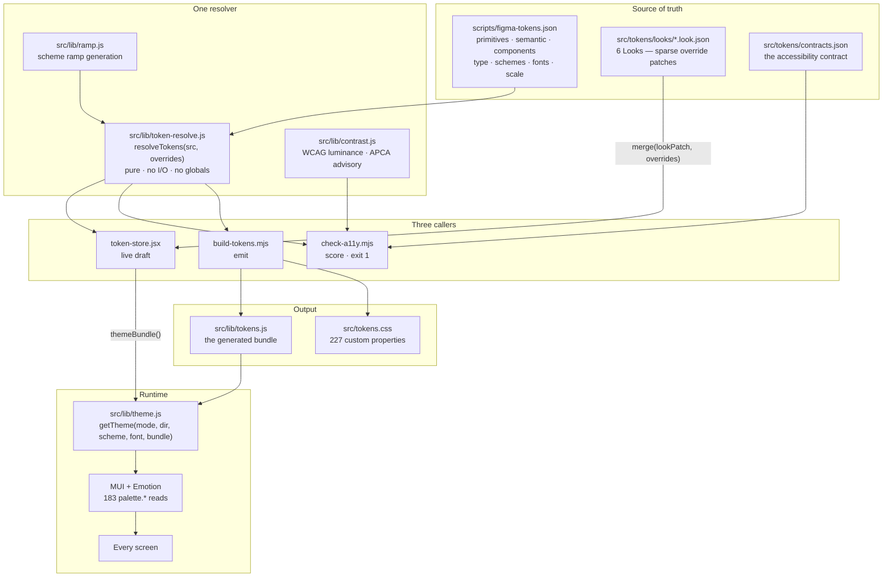
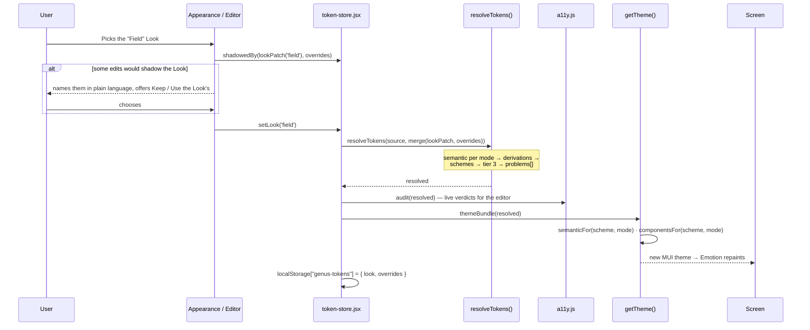

# Genus Solar — Design System & Front-End Architecture

> How the token system is structured, how a theme is applied at runtime, and how
> people change it. This is the reference; [AGENTS.md](../AGENTS.md) is the rulebook,
> [token-engine-architecture.md](token-engine-architecture.md) is the reasoning behind
> the engine, and [looks-workplan.md](looks-workplan.md) is what is built and what is not.

---

## Table of Contents

1. [High-level overview](#1-high-level-overview)
2. [Architecture diagram](#2-architecture-diagram)
3. [The three tiers](#3-the-three-tiers)
4. [The four axes](#4-the-four-axes)
5. [Layer-by-layer breakdown](#5-layer-by-layer-breakdown)
6. [Token taxonomy](#6-token-taxonomy)
7. [How a change flows end-to-end](#7-how-a-change-flows-end-to-end)
8. [The accessibility contract](#8-the-accessibility-contract)
9. [The three user interfaces](#9-the-three-user-interfaces)
10. [Chart theming](#10-chart-theming)
11. [Persistence](#11-persistence)
12. [Adding a Look](#12-adding-a-look)
13. [Adding a token](#13-adding-a-token)
14. [Known gaps](#14-known-gaps)
15. [Key files](#15-key-files)

---

## 1. High-level overview

**Stack:** React 19 · MUI v9 · Emotion · Vite 8 · ECharts 6 · TanStack Table v8

The system has one rule above all others, from [AGENTS.md](../AGENTS.md) §1:

> **Tokens are generated, never written.**

`scripts/figma-tokens.json` is the reviewed source of truth. `src/tokens.css` and
`src/lib/tokens.js` are emitted from it and carry a DO-NOT-EDIT banner that means it.
A wrong value is wrong *in the source*, and you fix it there or in the editor, then
regenerate with `npm run tokens`.

The design is deliberately **one resolver with three callers**:

| Caller | Uses the resolver to |
|---|---|
| `scripts/build-tokens.mjs` | Emit `src/tokens.css` and `src/lib/tokens.js` |
| `scripts/check-a11y.mjs` | Score every rendered colour pair and fail the build |
| `src/lib/token-store.jsx` | Preview live edits in the running app |

That sharing is the whole point. If the editor resolved tokens its own way, its
preview would be a plausible guess rather than the thing the build emits, and
*"it looked right in the editor"* would stop meaning anything.

### Numbers, so the scale is concrete

| | |
|---|---|
| Primitive families | 9 — `blue` `orange` `neutral` `success` `warning` `danger` `info` `white` `black` |
| Semantic roles | **29** |
| Component slots | **292**, across 16 components |
| Type styles | 12 · Spacing 11 · Radius 7 · Shadow 5 · Motion 4 · Layout 14 |
| Theme combinations | 6 Looks × 2 modes × 9 schemes × 7 fonts = **756** |
| Contract rows scored | 129 pairs × 9 schemes × 2 modes = **2322** (2016 scored, 306 exempt) |
| Known defects | **125**, ratcheted both ways |

---

## 2. Architecture diagram



---

## 3. The three tiers

One node shape; the tier is metadata plus an invariant on what the value may be.
That single difference *is* the tier discipline, and each violation is a nameable lint.

```
TIER 1 · PRIMITIVE          TIER 2 · SEMANTIC           TIER 3 · COMPONENT
a raw value                 a contextual role           a component slot
MUST NOT be an alias        MUST alias tier 1           MUST alias tier 2

blue.500 = #0467b2    →     action/primary/rest   →     button.contained.rest.bg
neutral.950           →     text/primary          →     tableRow.rest.fg
```

| Violation | Why it matters |
|---|---|
| A primitive holding an alias | Tier 1 is where values live; an alias here means the tiers have inverted |
| A semantic holding a raw hex | The role has stopped being a role |
| **A component aliasing a primitive** | **The subtle one.** Looks correct, breaks in dark mode — it has skipped the only layer that knows the mode |

### Why tier 3 exists at all

Because a button's fill is not one value. It is one per variant per state — five
variants × five states — and flattening that loses the thing the layer exists to
express. 292 slots is what honesty about component state costs.

### Derivations — the fourth kind of value

Some roles **cannot** be constants. `text/on-brand` was declared white in Figma and
white clears 4.5:1 on only 3 of 18 scheme/mode brand fills. So label colours are
computed against the fill they actually land on:

| Derivation | What it does |
|---|---|
| `onBrand` | Best of white / neutral-950 / black against the brand fill, min 4.5:1 |
| `focus/ring` | First brand step clearing 3:1 against the hardest surface |
| `action/primary/indicator` | Same, for the brand used as an indicator rather than a fill |

`{derive:onBrand}` in a component slot names the colour the theme *actually paints*.
Writing `{sem:text/on-brand}` there would have the token document claim white while
the product renders near-black — a layer contradicting the thing it describes.

---

## 4. The four axes

A theme is a point in four dimensions. Each axis has a different **permission**, and
the permissions are the safety model.

| Axis | Count | May change | May **not** change |
|---|---|---|---|
| `look` | 6 | Primitives, all 29 semantic roles, type, spacing, radius, shadow | Component slots · the contract |
| `mode` | 2 | Every semantic role | Primitives |
| `scheme` | 9 | **Brand hue only** | Neutrals, surfaces, text, borders, status ramps |
| `font` | 7 | `type.fontFamily` | Sizes, weights, everything else |

The scheme rule is written into the source file itself:

> *"A scheme changes the BRAND HUE ONLY. Neutrals, surfaces, text, borders and the
> status ramps never change — a colour scheme must not be able to break contrast or
> restyle a warning."*

That is why a Look is **not** a scheme. Every design system worth importing changes
neutrals and surfaces, so a Look needed its own axis with a wider permission — and
its own audit obligation, since the safety the scheme rule buys by construction has
to be re-bought by measurement.

### Applying a Look is a layer, not a write

```js
resolveTokens(source, merge(lookPatch(look), overrides))
```

The Look goes on first; **the user's own edits go on top and keep winning.** Nothing
is destroyed, so "apply" is reversible by unsetting one value. The only real
interaction is *shadowing* — an edit that silently overrides the Look and makes it
look broken — which `/admin/appearance` names explicitly rather than resolving quietly.

---

## 5. Layer-by-layer breakdown

### 5.1 Source — `scripts/figma-tokens.json`

Extracted from Figma (`get_variable_defs` for primitive hexes, `get_design_context`
for the light/dark alias table). Carries `$meta` recording file key, node and date.

```jsonc
{
  "primitives": { "blue": { "500": "#0467b2", … }, "neutral": { … } },
  "semantic":   { "surface/canvas": { "light": "white", "dark": "neutral.950" }, … },
  "components": { "button": { "$base": {…}, "$variants": { "contained": { "$states": {…} } } } },
  "type":       { "fontFamily": "Inter", "styles": { "body/m": { "size": 15, … } } },
  "schemes":    { "sunset": { "label": "Sunset", "ramp": "orange" }, "teal": { "base": "#2f9e9e" } },
  "fonts":      { "dmsans": { "label": "DM Sans", "stack": "\"DM Sans\", \"Inter\", sans-serif" } },
  "nonFigma":   { "spacing": {…}, "radius": {…}, "shadow": {…}, "motion": {…}, "layout": {…} }
}
```

### 5.2 Resolver — `src/lib/token-resolve.js`

Pure. Same input, same output, no I/O, no globals. `overrides` is a sparse patch over
the source, which is what makes a draft cheap: the editor never mutates the source, it
layers on top of it.

Key exports:

| Export | Purpose |
|---|---|
| `resolveTokens(src, overrides)` | The whole resolution. Returns semantic per mode, components, schemes, derivations, `problems` |
| `semanticFor(bundle, scheme, mode)` | **The one definition of what a scheme changes.** Used by `getTheme` and `paletteFor` |
| `componentsFor(bundle, scheme, mode)` | Tier 3 re-resolved per scheme, memoised on the bundle |
| `buildComponents(defs, ctx)` | Tier 3 against *one given* semantic map |
| `themeBundle(r)` | The subset `getTheme` consumes |
| `assertResolved(r)` | Structural checks the build treats as fatal |

**`problems` is a list, not a throw.** The editor has to be able to render an invalid
draft — that is how a user sees what is wrong and fixes it. Only the build treats a
non-empty `problems` as fatal.

### 5.3 Ramp generation — `src/lib/ramp.js`

Two of nine schemes carry Figma-given ramps (`default`, `sunset`). The other seven are
**generated from a base hue** along a fixed lightness curve:

```js
RAMP_LIGHTNESS = { 100: 92, 200: 80, 300: 69, 400: 58, 500: 47, 600: 38, 700: 28 }
```

Step 500 is the given base **verbatim** — the chosen colour is never "corrected".

The file also carries a full OKLab/OKLCH implementation with gamut mapping by chroma
reduction. It is **not** the default: `scripts/ramp-compare.mjs` measured HSL, OKLCH and
OKLCH-absolute at **113 failing rows each**, so the flip was cancelled rather than
costing a sign-off round for nothing. The code stays because seeding a ramp from an
arbitrary brand hue will want a perceptual space even though the existing schemes do not.

### 5.4 Looks — `src/tokens/looks/*.look.json`

A Look is a manifest plus a **sparse override patch in the exact shape the editor
already exports**. That is the entire reason no new resolver was needed.

```jsonc
{
  "id": "field",
  "version": "1.0.0",
  "label": "Field",
  "blurb": "Higher contrast and larger text — built for outdoor use.",
  "character": { "contrast": "high", "shape": "sharp", "depth": "flat", "density": "relaxed" },
  "provenance": { "source": "generated", … },
  "requires": { "schema": ">=1.0.0 <2.0.0" },
  "audit": { "gate": "wcag-2.2-aa", "modes": 2, "schemes": 9, "introduced": 0, "fixedVsStandard": 0 },
  "patch": { "semantic": { … }, "nonFigma": { … }, "type": { … } }
}
```

| Look | Character | vs Standard |
|---|---|---|
| **Standard** | The baseline. Permanent, never removable | baseline 125 |
| **Field** | High contrast, sharp, flat, relaxed — outdoor/glare use | +0 / −0 |
| **Calm** | Round, soft depth, relaxed density | +0 / −0 |
| **Compact** | Condensed rows and spacing, standard colour | +0 / −0 |
| **Contrast Dark** | Dark-first, high contrast — control-room use | **+0 / −23** |
| **Slate** | Near-monochrome, brand only at accents | **+0 / −8** |

### 5.5 Theme construction — `src/lib/theme.js`

`getTheme(mode, direction, scheme, fontId, T)` builds the MUI theme. `T` is a token
bundle — the generated one by default, or a live-resolved one from the editor. It is
destructured into names that **shadow the module-level imports**, so every reference
in the body reads from whichever bundle was passed without another line changing.

Rebuilding the theme measures **0.164 ms**. The cost of an edit is the React commit
underneath it, not the theme.

### 5.6 Transport — MUI theme object, not CSS variables

This is the most important architectural fact, and the one most likely to surprise
someone arriving from a shadcn/Tailwind system:

```
227  CSS custom properties emitted into src/tokens.css
  9  actually read as var(--genus-*)
183  read instead as theme.palette.*
```

The app reads its palette **through Emotion**, not through CSS variables. `tokens.css`
is imported and almost entirely unused — a hot-swap surface that exists but is not
wired. Migrating to CSS variables as the transport is
[token-engine-architecture.md](token-engine-architecture.md) §1.1's recommendation and
milestone M1, and it has not been built. See [§14](#14-known-gaps).

---

## 6. Token taxonomy

### Semantic roles — 29

| Group | Roles |
|---|---|
| Surface | `surface/canvas` `surface/base` `surface/raised` `surface/subtle` `surface/overlay` |
| Text | `text/primary` `text/secondary` `text/tertiary` `text/disabled` `text/on-brand` |
| Border | `border/default` `border/subtle` `border/strong` |
| Action | `action/primary/{rest,hover,pressed,indicator}` · `action/accent/{rest,hover,pressed}` |
| Focus | `focus/ring` |
| Status | `status/{success,warning,danger,info}/{foreground,background}` |

### Scale

| Category | Values |
|---|---|
| **Spacing** | `0 1 2 3 4 5 6 8 10 12 16` → 0–64px on a 4px base |
| **Radius** | `none 0` · `sharp 2` · `control 4` · `surface 8` · `large 12` · `xl 16` · `pill 999` |
| **Shadow** | `none xs sm md lg` — each with an explicit `darkAlpha` |
| **Motion** | `fast 120` · `medium 190` · `slow 280` · easing `cubic-bezier(0.2, 0, 0, 1)` |
| **Layout** | drawer/rail widths, top-bar heights, content padding, row heights, `targetMin: 24` |
| **Type** | `display/xl` `heading/2` `heading/3` `title/l` `title/m` `body/l` `body/m` `body/s` `label/l` `label/m` `label/s` `data/mono` |

> **Shadow `darkAlpha` is declared per level, never derived.** A shadow is a shortfall
> of light, and `md` is 0.10 against a light surface but 0.44 against a dark one. One
> global multiplier would quietly flatten every dark-mode Look.

### Component slot references

| Prefix | Points at |
|---|---|
| `{sem:…}` | A semantic role — the normal case |
| `{space:…}` `{radius:…}` `{motion:…}` `{layout:…}` `{type:…}` | The scale |
| `{derive:…}` | A computed value — `onBrand`, `accent`, `warning`… |
| `{mix:a,b,9}` | 9% of role `a` composited over role `b` |
| `{prim:…}` | A primitive — **legal but linted**, because it skips the mode-aware tier |

`{mix:}` exists because a translucent value has **no contrast ratio until you know its
backdrop**. Naming the backdrop in the token is what lets the accessibility engine
judge the pair at all, instead of skipping it silently or scoring it as opaque.

---

## 7. How a change flows end-to-end



**Landing a change is a separate act.** The editor never writes to disk. Export →
merge into `figma-tokens.json` → `npm run tokens`. That keeps the reviewed JSON the
source of truth and keeps every change a diff someone can read.

---

## 8. The accessibility contract

This is the layer that has no counterpart in most theme systems, and it is the reason
a Look can be *claimed* readable rather than hoped readable.

### `src/tokens/contracts.json`

Every foreground/background pair the product **actually renders**, so contrast becomes
decidable instead of a spot check.

> *"A pair that is not listed here is not checked — adding a rendered pair is part of
> adding a component."*

Tier-3 rows are **derived from each component's own `$pairs` declaration**, so declaring
a slot also declares its coverage. There is no second file to remember to update — which
matters because the failure mode is silent: an unchecked pair reads exactly like a
compliant one.

### Four verdicts

| Verdict | Meaning |
|---|---|
| `pass` | Cleared its threshold |
| `fail` | Did not. The only verdict that ever blocks |
| `exempt` | A declared WCAG provision. Reported, never scored. **Not a pass** — calling an exemption a pass is how a linter starts lying |
| `unknown` | Cannot be judged: a token is missing, or a translucent colour has no known backdrop. A gap in the contract, not a designer's defect — so it never blocks |

### The ratchet

`EXPECTED_DEFECTS = 125` in [`src/tokens/baseline.js`](../src/tokens/baseline.js), and it
points **both ways**. Fix a defect and the build fails until the marker is removed —
otherwise a stale marker suppresses a row that is now genuinely gated. Introduce one
behind an existing marker and the count rises and the build fails — otherwise the marker
hides a fresh regression, which is what a known-defect list is most likely to get wrong.

### Look admission

A Look must **introduce nothing**. Not "fail nothing" — the 125 describe rows of the
*shared* contract and are structural to the product, so that rule would have made every
Look impossible until someone first fixed all 125. `contrast-dark` retires 23 and `slate`
retires 8.

```
contrast OK — 2016 scored of 2322 rows (129 pairs × 9 schemes × 2 modes), 306 exempt, 125 known defects
looks OK — standard ✓ baseline 125 · field ✓ +0/-0 · calm ✓ +0/-0 · compact ✓ +0/-0
           contrast-dark ✓ +0/-23 · slate ✓ +0/-8      (+introduced / -fixed vs Standard)
```

### The two remaining defect causes

| Count | Cause |
|---|---|
| 113 | **The brand colour as 14px text** — 79 button, 25 navItem, 9 tab. The brand step is chosen to work as a fill and as a 3:1 indicator and clears neither bar as a label. Needs a third derived step: brand-as-text |
| 12 | **The contained label vs its hover and pressed fills.** The label derives from the rest fill, and in light mode the ramp crosses the luminance point where the required foreground flips, so no single label serves all three states |

WCAG 2.1/2.2 relative luminance is the **gate**. APCA is an advisory second column —
WCAG 3 is a Working Draft and APCA is not part of its normative text.

---

## 9. The three user interfaces

| Route | Audience | Purpose |
|---|---|---|
| **`/admin/appearance`** | Operator, brand owner | Pick a Look from a gallery. **The word "token" never appears** — nor "contrast", "semantic", "alias" or a hex value |
| **`/admin/design-tokens`** | Designer, developer | Every token in the product, editable live, with an audit tab |
| **`/gallery`** | Everyone | Every component in every state. There is no test suite; this is the substitute |

### `/admin/appearance`

Cards preview a **real slice of Overview and Alarms**, painted from each Look's own
resolved values through the same `resolveTokens` the build uses — so a card shows what
you would get, not what you already have. Swatch rows were rejected deliberately: a
swatch row is a token-literate way to preview, and this reader is the one person who
cannot read it.

**Terminology map:** scheme → *accent colour* · contrast audit → *readability* ·
contrast failure → *hard to read* · override → *your changes* · derived → *chosen
automatically*.

### `/admin/design-tokens`

Seven tabs: Primitives · Semantic roles · Components · Type · Spacing & scale ·
Schemes · Audit. A draft is a sparse override patch in `localStorage`, so *"what have
I changed"* needs no computation and export is the same object.

**Every edit is reversible at the scope the mistake happened at** — one slot, one
state, one variant, one component, one tier, or the whole draft.

### Store API — `useTokens()`

```
source · overrides · resolved · bundle · problems · changed
look · setLook · shadowedByLook
set · revert · revertUnder · changedUnder · changeList
apply · undo · redo
```

---

## 10. Chart theming

ECharts reads the MUI theme directly — [`src/components/charts.jsx`](../src/components/charts.jsx)
takes `useTheme()` and maps `t.palette.*` onto the ECharts option object:

```js
textStyle: { fontFamily: t.typography.fontFamily, color: t.palette.text.secondary },
xAxis: { axisLine: { lineStyle: { color: t.palette.border.default } } },
tooltip: { backgroundColor: t.palette.surface.overlay, borderColor: t.palette.border.default },
```

Because charts live inside React's theme context, they follow a Look, a scheme and a
mode change for free. No `getCSSVariable()` shim and no store-first/DOM-fallback
lookup is needed — a complication other systems carry because their charting library
sits outside the provider.

Status and band colours come from [`src/lib/bands.js`](../src/lib/bands.js) and the four
`status/*` semantic roles, not from per-widget chart tokens. That is deliberate: a token
per widget per element is the component-token explosion Adobe Spectrum moved away from
in v12.

---

## 11. Persistence

| Key | Holds | Written by |
|---|---|---|
| `genus-tokens` | `{ look, overrides }` | `token-store.jsx` |
| `genus-settings` | `{ layout, collapsed, direction, mode, scheme, font, width, density }` | `settings.jsx` |

Both use the same defence: **a corrupt or unknown draft must never break boot.**
Anything unparseable is dropped, not thrown. If `localStorage` is unavailable — quota,
private mode — the draft simply does not survive a reload.

Pre-Looks drafts migrate by detecting the **absence of the wrapper key**, not by
sniffing token names, so a future top-level token group cannot be mistaken for a draft
envelope.

Undo history is capped at 50 entries. Applying a Look pushes **one** entry, not 29.

---

## 12. Adding a Look

1. Copy an existing file in `src/tokens/looks/`. The `patch` is a sparse
   `figma-tokens.json` override — the exact shape the editor's export produces, so the
   fastest route is: edit live at `/admin/design-tokens`, export, paste in.
2. Register it in [`src/lib/looks/index.js`](../src/lib/looks/index.js) — a static import,
   no dynamic loading.
3. Run `npm run tokens`. The gate scores it across 9 schemes × 2 modes and names any
   pair it introduces, with the exact ratio and shortfall.
4. Adjust until `introduced: 0`. This loop is mechanical — the gate tells you which pair
   and by how much.
5. Record the result in the file's `audit` block.

> Keep the library at **six to eight**. Every Look is a permanent audit obligation
> across every mode and scheme, and past roughly eight the gallery stops being a choice
> and starts being a catalogue.

## 13. Adding a token

**Semantic role:** add to `semantic` in `figma-tokens.json` with a light and dark alias,
bump `EXPECTED_SEMANTIC`, add a contract row if anything renders it against something.

**Component slot:** add to the component's `$base` or `$variants.<v>.$states.<s>`, using
`{sem:…}` — never `{prim:…}` for a colour. Add the pair to the component's `$pairs` so
it is scored. **A new slot with no pair is unchecked, and unchecked reads exactly like
compliant.**

**Scale value:** add to `nonFigma`. Emitted automatically as `--genus-*` and available
on the theme.

Then `npm run tokens`, and never hand-edit `src/tokens.css` or `src/lib/tokens.js`.

---

## 14. Known gaps

Honest list. All are tracked in [looks-workplan.md](looks-workplan.md).

| Gap | Impact |
|---|---|
| **CSS variables are emitted but not the transport** — 227 out, 9 read, 183 `palette.*` | Milestone M1, unbuilt. Blocks cheap per-tenant theming and instant repaint without a React commit |
| **No brand-as-text derived step** | The 113-defect cause. Needs a third derivation plus a tier-3 rewire |
| **~29 `palette.primary.main` call sites do not distinguish fill from indicator** | The token exists; the rewire is deferred |
| **No cross-tab sync** | Change a Look in one tab, the others stay stale |
| **Persistence is not debounced** | A localStorage write on every colour-picker frame |
| **Shadows are defined but unread** | The product is deliberately flat; `MuiPaper` defaults to elevation 0 and cards separate by border |
| **Internal tool vs tenant-facing branding undecided** | [token-engine-architecture.md](token-engine-architecture.md) §5.1. Moves `read`/`write` in the token store, and changes whether enforcement is a preference or mandatory |

### Three traps worth knowing before you touch this

1. **`palette.action` is a reserved MUI key.** `palette.action.primary` is `undefined`.
2. **In `sx`, a bare number on `borderRadius`/`padding`/`gap` is a multiple of the theme
   scale.** `borderRadius: 8` renders as 64px. Use a px string for resolved values.
3. **MUI v9 does not apply `styleOverrides.variants` here.** Component overrides need
   class selectors — `"&.MuiButton-outlined.MuiButton-colorPrimary"`.

---

## 15. Key files

| File | Purpose |
|---|---|
| [`scripts/figma-tokens.json`](../scripts/figma-tokens.json) | **The source of truth.** Everything else is generated or derived |
| [`src/lib/token-resolve.js`](../src/lib/token-resolve.js) | The resolver. One implementation, three callers |
| [`src/lib/ramp.js`](../src/lib/ramp.js) | Scheme ramp generation · HSL and OKLCH |
| [`src/lib/contrast.js`](../src/lib/contrast.js) | WCAG luminance, APCA, compositing, `bestOn`, `stepClearing` |
| [`src/lib/a11y.js`](../src/lib/a11y.js) | The live audit engine · `paletteFor`, `judge`, `audit` |
| [`src/tokens/contracts.json`](../src/tokens/contracts.json) | The accessibility contract |
| [`src/tokens/baseline.js`](../src/tokens/baseline.js) | `EXPECTED_DEFECTS` — the two-way ratchet |
| [`src/tokens/looks/`](../src/tokens/looks/) | The six Looks |
| [`src/lib/looks/index.js`](../src/lib/looks/index.js) | Look registry · `LOOKS`, `lookPatch`, `shadowedBy` |
| [`src/lib/token-store.jsx`](../src/lib/token-store.jsx) | Live draft state · undo/redo · persistence |
| [`src/lib/theme.js`](../src/lib/theme.js) | `getTheme()` — token bundle → MUI theme |
| [`src/lib/settings.jsx`](../src/lib/settings.jsx) | Mode, scheme, font, layout, density |
| [`src/pages/appearance.jsx`](../src/pages/appearance.jsx) | `/admin/appearance` — the operator's gallery |
| [`src/pages/design-tokens.jsx`](../src/pages/design-tokens.jsx) | `/admin/design-tokens` — the editor |
| [`scripts/build-tokens.mjs`](../scripts/build-tokens.mjs) | Emitter |
| [`scripts/check-a11y.mjs`](../scripts/check-a11y.mjs) | The gate. `npm run tokens` exits 1 on any shortfall |
| [`scripts/ramp-compare.mjs`](../scripts/ramp-compare.mjs) | Colour-space measurement harness |

### Commands

```bash
npm run dev       # port 5173
npm run tokens    # regenerate + gate — exits 1 on any contrast shortfall
npm run build
```
