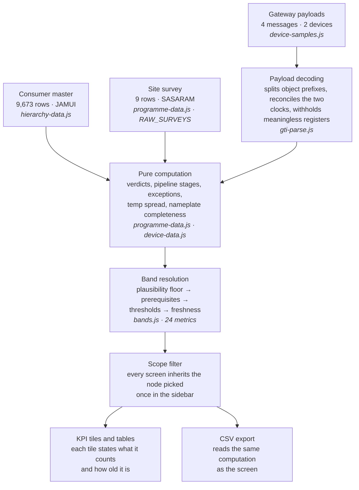

# Genus Solar — screen and data reference

**SBPDCL rooftop solar rollout programme**

A walkthrough of every screen in the platform — what each one is for, who uses it, and exactly
which bytes the numbers on it come from.

| | |
|---|---|
| Routes | 21 |
| Built | 17 |
| Data sources | 3 |
| Banded metrics | 24 |
| Prepared | 19-08-2026 |

**Companions:** [dashboard-ia.md](dashboard-ia.md) · [ia-and-screen-plan.md](ia-and-screen-plan.md) ·
[dms-parity-plan.md](dms-parity-plan.md) · [AGENTS.md](../AGENTS.md)

---

## Contents

1. [The brief](#1--the-brief)
2. [Where the data comes from](#2--where-the-data-comes-from)
3. [How a number reaches the screen](#3--how-a-number-reaches-the-screen)
4. [The rules that govern display](#4--the-rules-that-govern-display)
5. [Screens, one by one](#5--screens-one-by-one)
6. [Demo script](#6--demo-script)
7. [Open questions](#7--open-questions)
8. [Glossary](#8--glossary)

---

## 1 · The brief

South Bihar Power Distribution Company is rolling out rooftop solar to domestic consumers. The
programme runs in three overlapping phases — **register** consumers, **survey** their rooftops for
feasibility, then **install and monitor** the hardware. Genus Solar is the platform that carries all
three.

### Who uses it

| Role | What they come here to do | Screens they live in |
|---|---|---|
| **Programme manager** | Is the rollout on track in this circle? Where is it stalling? | Overview, Sites, Reports |
| **Field surveyor** | Submit rooftop surveys; see which of mine were rejected and why | Sites, Alarms |
| **Design / procurement** | What are we actually building on? Roof age, orientation, cable runs | Assets, Reports |
| **Service engineer** | Which installed device needs a visit, and what is wrong with it? | Alarms, Devices, Telemetry |
| **Data / integration** | Did last night's load arrive? Did it parse? What broke? | Ingestion health, Batch history, Import |
| **Administrator** | Who has access to what, across which part of the hierarchy | Users, Roles, Organisation |

### The governing principle

> **No screen invents a number.** Where a figure cannot be computed honestly, the platform shows a
> dash and states the reason — never a plausible-looking zero. This is not conservatism; it is the
> product's core value proposition. A distribution utility acts on these figures, and a confident
> wrong number costs a truck roll.
>
> Every "empty" you see in the demo is therefore *content*, not a gap in the build. Each one names
> what is missing and what would fill it.

---

## 2 · Where the data comes from

Three real sources feed the entire platform. Everything else on screen is computed from them.

| Consumers | Surveys | Payloads | Hierarchy nodes | Exceptions found |
|---:|---:|---:|---:|---:|
| 9,673 | 9 | 4 | 52 | 22 |

### Source 1 — Consumer master

| | |
|---|---|
| **Format** | CSV extract from the billing register |
| **Volume** | **9,673 rows**, all in **JAMUI circle** |
| **Arrived** | 04-08-2026 14:14:45 — as **8 separate loads on one day**; only the last `Created On` stamp survives in the extract |
| **Carries** | Consumer number, full geography chain (circle → district → sub-division → section → panchayat), created-on, created-by |
| **Feeds** | Every *registered* count in the product; the entire hierarchy tree; every coverage denominator |
| **Caution** | **Contains PII** — real names and mobile numbers. Deliberately *not* bundled into the browser build. The platform shows consumer *numbers* only. |

### Source 2 — Site survey

| | |
|---|---|
| **Format** | CSV export from the field survey app |
| **Volume** | **9 rows**, all in **SASARAM circle / Kaimur district** |
| **Arrived** | 07-08-2026 — submitted per row by two surveyors, not loaded as a batch |
| **Carries** | Rooftop status and construction year, shadow-free assessment, orientation, floor count, access method, structure and earthing cable runs, GPS with accuracy radius, ten photo slots, contractor and employee attribution |
| **Feeds** | Feasibility verdicts, asset condition, the exception queue, surveyor attribution on Users |
| **Caution** | Verdicts are **recomputed from the rules on every load**, never hand-entered. An earlier hand-typed set got 5 of 9 wrong. |

### Source 3 — Gateway payloads

| | |
|---|---|
| **Format** | Live pub-sub messages, topic `rtsg-1 / Ongridrooftop` |
| **Volume** | **4 messages from 2 gateways** — a 2-minute capture, 16-08-2026 19:29→19:32 UTC |
| **Carries** | 3 Data frames and 1 Heartbeat. Each Data frame holds ~60 net-meter fields plus the meter's own nameplate; the Heartbeat holds gateway flags, signal and board temperature. |
| **Feeds** | Device registry, GTI and Meter telemetry, ingestion health, 11 of the 22 exceptions |
| **Caution** | **This is a sample, not the fleet.** The source system holds 151 devices; we hold 2. Every screen using it says so in a banner. |

### ⚠ The single most important caveat in this document

> **The consumer master and the survey extract do not join.** The master is 9,673 consumers in
> JAMUI. The surveys are 9 rooftops in SASARAM. The overlap is **zero rows**.
>
> So *coverage %* — surveys ÷ registrations, the number every stakeholder asks for first — is
> genuinely uncomputable today. The platform prints a dash and the reason, because dividing one
> circle's surveys by another circle's registrations would produce a confident, meaningless
> `0.09%`. Expect this question in the demo; the honest answer is a feature.

### Two traps in the source data worth naming

- **The `* Code` columns are not codes.** Circle Code equals Circle Name; Panchayat Code is the name
  with the spaces stripped. Nothing keys on them — the platform generates its own node ids and keeps
  the source column for reference only.
- **Two date formats appear in the same row.** `07-08-2026, 16:18` and `07-08-2026 16:27:34`. Both
  are parsed; anything else is rejected at import, because `new Date("07-08-2026")` silently reads
  as 8 July.

---

## 3 · How a number reaches the screen

Every figure in the product travels this path. Nothing is stored state; it is recomputed on each
load.

> **Why this matters for the demo.** Reports and the dashboards call the *same functions*. There is
> no separate reporting pipeline to drift out of sync. If a stakeholder challenges a figure in an
> export, you can trace it to the source row in three hops.

---

## 4 · The rules that govern display

Four conventions run across every screen. Knowing them makes the whole product legible.

### 1 · Five bands, four of them coloured

Every measurement resolves to one of five states. **Normal gets no colour at all** — plain text.
Emphasis is a zero-sum budget: in a twenty-column grid where every cell is tinted, the one cell that
matters disappears.

| Band | Rendered as | Meaning |
|---|---|---|
| Normal | Plain text, tabular numerals | In range. No attention needed. |
| Watch | Dot and word, no fill | Drifting. Worth noticing on a sweep. |
| Warning | Filled chip | Out of range. Schedule an action. |
| Critical | Filled chip | Act now. |
| Unknown | De-emphasised, plus the reason | Cannot be judged — and the reason is always given. |

Green is reserved for an explicit *Healthy* answer at object level — never for an in-range
measurement.

### 2 · The plausibility floor runs before the thresholds

A threshold set answers *is this good or bad*. It cannot answer *is this a reading at all* — and
conflating the two paints a confident colour on a broken sensor.

| Real value from the extracts | Naive result | What the platform shows |
|---|---|---|
| Pack temperature `−58 °C` *(thermistor open circuit)* | **Critical** — red chip, engineer dispatched to a working battery | **Unknown** — "is a known sensor-fault sentinel for this field" |
| Grid voltage `0.00 V` *(41 of 42 UPS rows)* | **Critical** — a fleet-wide brownout that is not happening | **Unknown** — "0.00 V is how the extract represents no reading" |
| Board temperature `−127 °C` *(1-wire "no sensor present")* | A thermal alarm on a gateway with no thermometer | **Unknown** — value still shown, judgement withheld |

### 3 · An unknown band suppresses the judgement, not the value

These are two different facts and they must not look alike:

- **Value present, not judgeable** (stale, implausible, no nameplate) → the number, de-emphasised
  and italic, with the reason on an info affordance. A gateway reporting 239.92 V seventeen hours
  ago still shows 239.92 V.
- **Value genuinely absent** (the failed meter read, where the parser nulls the measurements) → an
  em dash.

### 4 · Counts state their population

Every KPI tile carries a freshness line saying what it counts and how old it is. The source system
is the cautionary tale: its dashboard cards read `146 / 63 / 76` while its own tables hold
`151 / 44 / 42` — and the gap is unexplainable, because neither figure says what it counts.

---

## 5 · Screens, one by one

Every route in the navigation, with its use case, its user, and its exact data source.

| Tag | Means |
|---|---|
| `LIVE DATA` | Fully populated from a real source. |
| `SAMPLE` | Real data, but a 2-device sample rather than the fleet. Banner says so. |
| `AWAITING EXTRACT` | Screen is complete; the source system holds the rows but they have not been exported yet. |
| `BLOCKED` | Cannot be built — the data or the capability does not exist anywhere. |
| `NEW` | Added in this build. |

### Programme

#### `/overview` — Overview · `LIVE DATA`

- **Use case** — The first screen of the day. **Is the rollout healthy in my scope, and where is it stalling?**
- **Primary user** — Programme manager
- **Shows** — Six programme tiles (Registered 9,673 · Surveyed 9 · Coverage — · With conditions 8 · Needs revisit 1 · Open exceptions 11), a Users & devices deck, a nine-stage pipeline, and registered-by-area ranking.
- **Data source** — Consumer master + site survey, via `programme-data.js`; device tiles via `device-data.js`
- **Demo note** — **Coverage renders as an em dash.** That is the master↔survey join problem, stated on the tile. Four device tiles read *Not configured* with their reason, not `0`.

#### `/alarms` — Alarms — Inbox · `LIVE DATA`

- **Use case** — The queue you work down. **What is actually wrong, worst first?**
- **Primary user** — Service engineer, field surveyor
- **Shows** — **22 real defects** — 3 critical, 19 warning; 11 from the extracts and 11 from the gateway payloads. Each row names the defect and explains the consequence.
- **Data source** — Recomputed on every load by `exceptionsFor()` and `deviceExceptionsFor()`. Nothing here is stored state.
- **Demo note** — The strongest screen to lead with. Every row is a genuine finding — meter clocks 25 days behind and 72 days ahead, tamper bits asserted, energy registers that contradict each other, a device the payload places nowhere.

#### `/alarms/rules` — Alarms — Rules · `NEW` `LIVE DATA`

- **Use case** — **Why did that raise an alarm?** The thresholds behind every judgement, in one place.
- **Primary user** — Service engineer, analyst, anyone auditing a verdict
- **Shows** — All **24 metrics** — low-side and high-side bounds, unit, direction, plausibility range with named sensor sentinels, nameplate prerequisites, and whether the threshold is derived or a domain seed. Grouped by Programme (6) / Battery (8) / Grid and meter (4) / Gateway (5) / Modes (1). **14 of 24** carry a plausibility floor; **5** are gated on nameplate.
- **Data source** — A live view of `bands.js` — the same registry every value in the product resolves through, not a copy of it.
- **Demo note** — Read-only by design. Thresholds are data, not settings. **12 of 24 are marked "Seed default"** — honest flagging that they are domain defaults awaiting field derivation.

#### `/sites` — Sites · `LIVE DATA`

- **Use case** — The drill-down behind Overview's counts. **Show me the actual records.**
- **Primary user** — Programme manager, field surveyor
- **Shows** — One row per rooftop visited — roof type, orientation, feasibility verdict *with the specific reasons behind it*, GPS accuracy, contractor and employee.
- **Data source** — The 9 transcribed survey rows. Verdicts recomputed, never stored.

#### `/assets` — Devices — registry · `SAMPLE`

- **Use case** — **What hardware do we have, where, and can we trust what it reports?**
- **Primary user** — Service engineer, asset manager
- **Shows** — Device number, class, model, freshness, state, site — and **nameplate completeness**, which decides whether that device's telemetry can be banded at all.
- **Data source** — Devices derived from the gateway traffic itself (`device-data.js`)
- **Demo note** — **No consumer PII.** The source system's registry leads with Consumer Name, Mobile No. and Owning User Email; this one shows the consumer *number* only. Nameplate completeness reads a true **50%** because the gateways report empty firmware and hardware — not a fabricated 100%.

#### `/assets/condition` — Assets — rooftop condition · `LIVE DATA`

- **Use case** — **What are we physically building on?** Aggregate condition for design and procurement.
- **Primary user** — Design and procurement
- **Shows** — Feasibility mix, orientation mix, roof age, floors, and the structure and earthing cable runs a build actually needs to quote.
- **Data source** — The same 9 survey rows, aggregated rather than listed
- **Demo note** — Deliberately kept separate from the device registry. Merging them would repeat the source system's own structural mistake, where *Devices* is a registry and *BMS Devices* is telemetry and nothing in the labels says so.

### Telemetry

#### `/telemetry/gti/:tab` — GTI — gateways · `SAMPLE`

- **Use case** — **What is the gateway itself doing?** Signal, flags, board health, message cadence.
- **Primary user** — Service engineer, integration
- **Shows** — Four streams as *separate URLs*: `data` (3 rows) · `heartbeat` (1) · `info` (0) · `on-demand` (0). Each row opens its raw JSON payload.
- **Data source** — Parsed pub-sub messages via `gti-parse.js`
- **Demo note** — Tabs are route segments, not component state — a link to one stream survives being pasted into a ticket. The two empty streams state which message type is missing from the capture.

#### `/telemetry/meter` — Meter — net metering · `SAMPLE`

- **Use case** — **What is this rooftop exporting, and is the billing data trustworthy?**
- **Primary user** — Billing, service engineer
- **Shows** — Voltage, frequency, power factor, import *and* export energy, max-demand registers, tamper status, meter nameplate.
- **Data source** — The `MS-*` body of every gateway Data message
- **Demo note** — **This screen exists because of a discovery.** The source system labels this stream "GTI Data" and shows five envelope columns, discarding the sixty-odd meter fields underneath. Import *and* export registers on a single-phase C3 meter is net metering — this is the revenue meter, the most consequential data in the payload, and it was being thrown away.

#### `/telemetry/bms` — BMS — battery packs · `AWAITING EXTRACT`

- **Use case** — **Which battery is degrading, and is it a real fault or a broken sensor?**
- **Primary user** — Service engineer
- **Shows** — ~20 columns with a default visible set of 8. Adds three the source system lacks: **temperature spread**, **cell delta**, and **autonomy**.
- **Data source** — Source system holds **44 pack readings**; not yet exported
- **Demo note** — Spread is computed only across thermistors that pass the plausibility floor. A pack reading 27 °C on one probe and −58 °C on three does not have an 85 °C spread — it has one working probe. The naive version would manufacture a critical thermal alarm out of a wiring fault.

#### `/telemetry/ups` — UPS · `AWAITING EXTRACT`

- **Use case** — **Is the load protected right now?**
- **Primary user** — Service engineer
- **Shows** — Mode leads the table, then voltage and load.
- **Data source** — Source system holds **42 readings**, of which 41 report `0.00 V` — silence rendered as a number
- **Demo note** — **Mode is added, and it leads.** Bypass is the highest-severity state in the fleet and raises no fault of its own — the unit is healthy, the load is live, and there is no protection between them. The source screen omits mode entirely, so the most dangerous state a UPS can be in is invisible in the product that monitors it.

### Data

#### `/data/import` — Import · `NEW` `WORKING`

- **Use case** — **Will this file import cleanly?** Answered before anything is committed.
- **Primary user** — Data / integration
- **Shows** — Pick a schema, choose a CSV, get a real report: rows read, rows that would import, errors, warnings, and a findings table with 1-based row numbers matching a spreadsheet.
- **Data source** — **Your file.** Parsed in the browser — nothing is uploaded.
- **Demo note** — This is a genuine validator, not a mock. It catches missing columns, duplicate keys, Null Island coordinates, malformed consumer numbers, both date-format traps, and flags `* Code` columns as unjoinable. **Commit is deliberately absent** — there is no ingest endpoint, and a disabled button would imply a permissions problem rather than a missing capability.

#### `/data/health` — Ingestion health · `NEW` `SAMPLE`

- **Use case** — **Is data arriving, how late, and did it parse?**
- **Primary user** — Data / integration
- **Shows** — Median ingest lag **4.5 s**, gateways seen, failed reads; all six expected streams with a reason for each that is delivering nothing; per-message lag against each device's declared cadence; per-device message-sequence gap check.
- **Data source** — Measured from the payloads — the filename is UTC, the payload timestamp is IST, and the gap between them *is* the lag
- **Demo note** — Cadence is checked against `STINTERVAL`, which each device declares per message — 15 min on Data, 30 on Heartbeat. Freshness measures against what the device says it will do, so a gateway that changes cadence stays correctly classified with no code change.

#### `/data/history` — Batch history · `NEW` `LIVE DATA`

- **Use case** — **What arrived, when, and from whom?** The record you check when a figure looks wrong.
- **Primary user** — Data / integration, programme manager
- **Shows** — Three ingests — because three have happened. Rows, physical loads, arrival, ingested-by, and provenance notes.
- **Data source** — Real arrival stamps from all three sources
- **Demo note** — **Rollback is unavailable and the screen says why.** The spec keys it on `import_batch_id` and no source row carries one — so there is no key to reverse by. The consumer master row also shows **8 physical loads** behind one logical extract, which is what its own timestamps say.

#### `/reports` — Reports · `LIVE DATA`

- **Use case** — **Get this out of the platform and into a meeting.**
- **Primary user** — Programme manager, analyst
- **Shows** — Four computed views — Programme summary, Exceptions, Site records, Asset condition — with CSV export.
- **Data source** — The same functions the dashboards call
- **Demo note** — **No date range and no period-over-period comparison**, and the header says why: there is one snapshot of this data, so a trend line would have to be invented. Expect this to be challenged; the absence is the honest answer.

### Administration

#### `/admin/users` — Users · `ADD USER` `LIVE DATA`

- **Use case** — **Who has touched this data, and who should have access?**
- **Primary user** — Administrator
- **Shows** — Two populations in one table, kept distinct by an *Origin* column:
  - **Observed** — the 3 accounts stamped on the extracts (1 bulk import, 2 field surveyors), with their real in-scope survey counts
  - **Provisioned** — accounts created here, carrying an RBAC role and a hierarchy scope
- **Data source** — `Created By` / `Employee ID` values on both extracts
- **Demo note** — The **Add user** flow validates name, employee-ID format, role and scope, and **rejects an employee ID that collides with a real surveyor's** — reusing 11126 would silently re-attribute Deepak Kumar's submissions. Provisioned accounts are session-only and say so in three places; there is no auth backend to persist to.

#### `/admin/roles` — Roles · `NEW` `SPECIFICATION`

- **Use case** — **What can each role reach?**
- **Primary user** — Administrator, security reviewer
- **Shows** — Five roles — Super Admin, Admin, Service Engineer, User (store operator), and the new read-only **Analyst** — against all nine nav destinations, with qualifiers preserved.
- **Data source** — The screen plan's own access table, held against the real nav tree
- **Demo note** — Definitions, not grants — nothing is enforced yet. The qualifiers matter: *full · own* is not the same grant as *full*, and flattening them would let a store operator's own-site access read as fleet-wide. A route added to the nav without a permission decision appears here as a gap rather than defaulting to visible.

#### `/admin/organisation` — Organisation · `LIVE DATA`

- **Use case** — **Browse or export the whole hierarchy at once.**
- **Primary user** — Administrator
- **Shows** — All **52 nodes** flattened — 1 discom, 2 circles, 2 districts, 6 sub-divisions, 15 sections, 26 panchayats.
- **Data source** — Generated from the two source CSVs at build time
- **Demo note** — Registered counts sit **only on panchayat leaves**. Putting a count on an interior node as well double-counts on roll-up — that bug once rendered 19,346 consumers against a file holding 9,673.

### Reachable, deliberately not built

These four routes resolve to a real page rather than a dead link. Each states its specific blocker
and what would unblock it — none is waiting on effort.

| Route | Would be | Blocked by | Unblocked when |
|---|---|---|---|
| `/telemetry/solar` | PV generation vs installed kWp | **Blocked at both ends.** No inverter object appears in any payload — the stream named "GTI Data" carries a net meter, not an inverter — so no numerator. And `rated_kw` is absent from the nameplate, so no denominator. | An inverter object arrives, *and* rated capacity lands on the nameplate |
| `/admin/audit` | Administrative action log | An audit entry is an event that has to have happened. No auth layer means no action is attributable, and nothing yet writes a durable change. | Auth exists, and a write path exists to record |
| `/account/profile` | Your account and sign-out | There is no sign-in, so there is no "you". The avatar is a chip, not a session. | Auth layer ships |
| `/account/support` | Raise and track an issue | No ticket store exists anywhere — including in the source system. This is a new capability, not an un-ingested one. | A decision on where tickets live, plus auth |

A fifth route, `/gallery`, is the component gallery — every component in every state. There is no
automated test suite; the gallery is the substitute.

---

## 6 · Demo script

Roughly 15 minutes. Ordered so the credibility argument lands before the feature tour, because the
product's strongest claim is about trustworthiness, not coverage.

### 01 · Open on Alarms, not Overview

`/alarms`

Lead with 22 real defects rather than a dashboard. It establishes immediately that this is running
on real data.

> "Every row here is a genuine defect in the data you already have. One meter's clock is 25 days
> behind; another is 72 days ahead. Both are internally consistent — so every billing period they
> stamp is wrong in the same direction, and nothing else on the row looks wrong."

### 02 · Open the tamper row, then the raw payload

`/alarms` → JSON action

Shows the decoded finding and the bytes behind it side by side.

> "Three tamper bits are asserted. We report the positions and stop — the bit meanings are
> undocumented, and inventing labels would be worse than the raw code, because a raw code at least
> looks like something to go and check."

### 03 · Show the coverage dash on Overview

`/overview`

Get ahead of the obvious question rather than waiting to be asked.

> "Coverage is the number everyone wants and we're showing a dash. The consumer master is 9,673
> people in Jamui; the surveys are 9 rooftops in Sasaram. Zero overlap. We could print 0.09% — it
> would look like a real figure and it would mean nothing."

### 04 · Switch scope in the sidebar

Sidebar hierarchy picker → JAMUI, then SASARAM

Demonstrates that scope is picked once and every screen inherits it.

> "Context is chosen in one place. There are no per-page filters to get out of sync — every figure
> on every screen re-derives against this node."

### 05 · Show the plausibility floor on Alarm rules

`/alarms/rules` → Battery group → Pack temperature

The single best demonstration of the product's design philosophy.

> "Minus 58 is listed as a sentinel, not a temperature. A naive threshold set calls that critical —
> red chip, alarm raised, engineer dispatched to a perfectly healthy battery. We resolve it to
> unknown and say why. That check runs before the thresholds, not after."

### 06 · Run a live import dry-run

`/data/import`

Bring a deliberately broken CSV. This is the most interactive moment in the demo.

> "This is parsing your actual file in the browser. Duplicate key on row 4, coordinates at Null
> Island on row 3, and this date is rejected even though it's a valid date — because in that format
> JavaScript reads it as July, and you'd import a month of readings into the wrong period without a
> single error."

### 07 · Show ingestion health

`/data/health`

The integration audience's screen.

> "4.5 second median lag, measured — the filename is UTC and the payload timestamp is IST, and the
> gap between them is the real number. Cadence is checked against what each device declares it will
> do, not a constant somebody guessed."

### 08 · Add a user, then show the collision guard

`/admin/users` → Add user

Try employee ID `11126` first — it belongs to a real surveyor.

> "It's rejected because 11126 is already on file. If we'd allowed it, that account would quietly
> inherit Deepak Kumar's seven submissions."

### 09 · Close on a blocked screen

`/telemetry/solar`

Counter-intuitive but effective — it converts the biggest gap into the clearest ask.

> "This one we can't build, and here's exactly why: no inverter object in any payload, and no rated
> capacity on the nameplate. No numerator, no denominator. Get us either and this screen ships; get
> us both and it's complete."

### Two things to have ready

- **A broken CSV** for step 6 — include a duplicate consumer number, a `0,0` coordinate, and a date
  written as `2026/08/07`.
- **An answer for "why is so much empty?"** — 17 of 21 routes are built. The empties are two
  categories: four screens whose rows exist in the source system and simply have not been exported
  (BMS 44 readings, UPS 42, Devices 151), and four that are blocked on a capability nobody has yet.
  Neither is a build gap.

---

## 7 · Open questions

Decisions needed from the client side. Ranked by how much they unblock.

| # | Question | Blocks | Owner |
|---|---|---|---|
| 1 | **Can the consumer master and survey extract be joined?** Today they cover different circles with zero overlap. | Every coverage percentage in the product | Data owner |
| 2 | **When does the bulk device export land?** 151 devices, 44 BMS readings, 42 UPS readings exist in the source system. | Devices, BMS, UPS, four dashboard tiles | Integration |
| 3 | **Are the meter clocks actually drifting?** One reads 25 days behind, another 72 days ahead, each internally consistent. | Everything billing-related | Metering team |
| 4 | **Consumer PII in the device registry** — masked, server-side, or scope-gated? | Registry column set | Compliance |
| 5 | **Are Backup Status / Inverter Mode / Inverter Status documented enums?** Or must we reverse them from payloads? | Device report, status decoding | Firmware |
| 6 | **Where is the inverter object?** No sample payload contains one. | Solar screen entirely | Firmware |
| 7 | **Is `ASN_21` the join key to the consumer register?** If it joins, it unblocks question 1. | Coverage, device placement | Data owner |
| 8 | **Is Analyst in scope as a fifth role?** Or does warranty work stay an export? | RBAC scope | Product |
| 9 | **Excel export — required, or is CSV acceptable?** The source system offers both; we ship CSV only. | Two screens' toolbars | Product |

### Known limits worth stating before someone finds them

- **No table virtualisation.** The consumer register will be tens of thousands of rows per circle,
  which breaches the current assumption. Needs virtual scrolling or server-side pagination before it
  meets real data.
- **No internationalisation layer.** RTL is fully wired at the layout level — the mechanical half is
  done — but every user-facing string is still a literal.
- **Twelve of 24 thresholds are domain seeds**, not derived from this fleet. They are labelled as
  such on the Rules screen and must be re-derived per pack design and per tariff before field use.
- **No permission-denied layout.** Locked content has a chip; locked routes render nothing. With
  five roles this now needs designing.

---

## 8 · Glossary

Terms that come up in the demo and mean something specific here.

| Term | Meaning in this product |
|---|---|
| **Band** | The judgement attached to a measurement — normal, watch, warning, critical, unknown. Data, not code: adding a metric means adding a registry entry, never writing a condition at a call site. |
| **Plausibility floor** | A per-metric range and sentinel list checked *before* thresholds, so a broken sensor resolves to unknown rather than critical. |
| **Sentinel** | A value a device emits to mean "no reading" — `−58 °C`, `−127 °C`, `0.00 V`, `(0,0)`. Never a measurement. |
| **Freshness** | How current a reading is, measured against the device's own declared interval: live · late · stale · offline. Stale and offline readings get no band. |
| **Nameplate** | Device configuration — firmware, hardware, manufacturer, model, series count, rated capacity. Several metrics cannot be judged without it, and return unknown rather than a confident normal. |
| **Scope** | The hierarchy node selected in the sidebar. Every figure on every screen is computed against it. Separate from *role*: role says what you may do, scope says what to. |
| **Verdict** | A survey's computed feasibility outcome. Always recomputed from the rules, never stored. |
| **Net metering** | Import and export registers on the same meter — the consumer is billed on the net. What the `MS-*` payload body carries. |
| **Msg seq** | The per-device message counter. Deliberately not called "Msg ID" — it is a sequence, so a gap in it means a lost message. |
| **Ingest lag** | Broker arrival time minus payload timestamp. The filename is UTC and the payload is IST; both are parsed with their offset stated, because adopting the viewer's timezone would make the figure wrong by hours outside India. |
| **Not configured** | A tile state, not a zero. Means no record of this kind exists in the source, and says which. |

---

*Genus Solar · SBPDCL rooftop programme · Screen and data reference · 19-08-2026*
