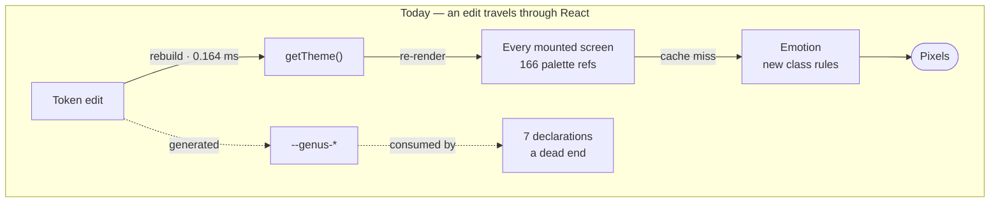
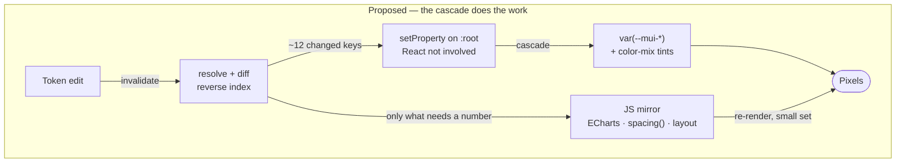
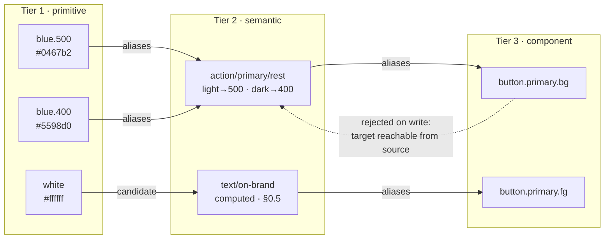
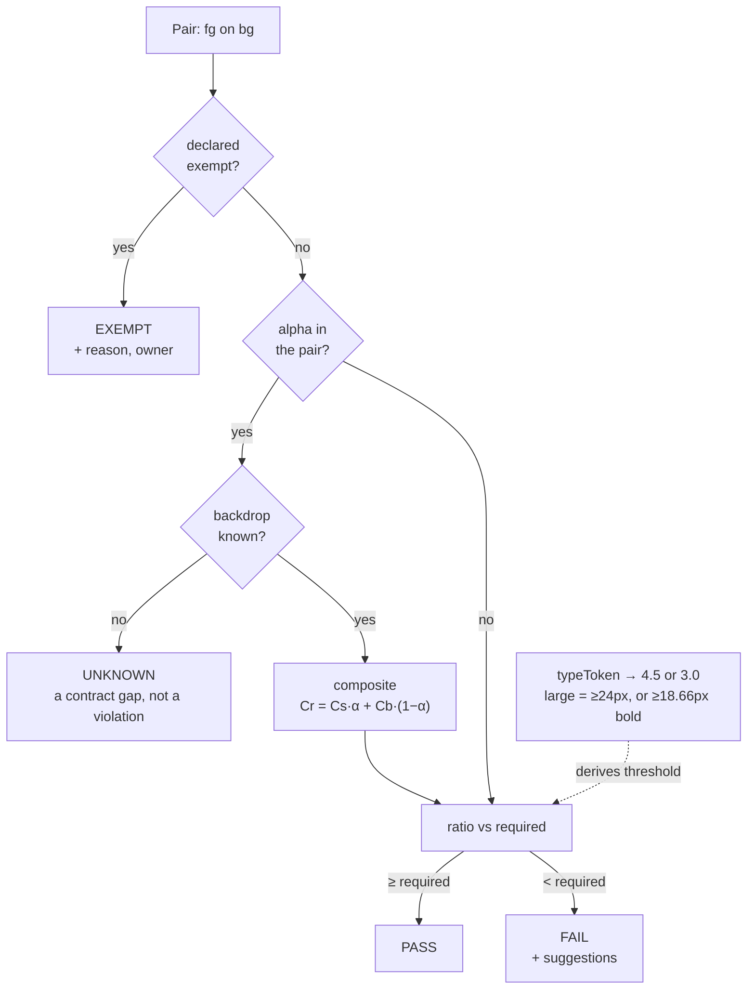

# Genus Token Engine — runtime token manager and live variable editor

**An architecture for editing this design system while it runs.** Multi-tier token hierarchy,
runtime hot-swapping, WCAG AA guardrails, DTCG interoperability. Every measurement below was
executed against this working tree rather than estimated, and three of the findings in §0 reverse
the architecture the brief implies.

| | |
|---|---|
| Written against | `Genus-Solar-project` @ `7ddf66b` · React 19 · MUI 9.3.1 · Vite 8 |
| Existing pipeline | `scripts/figma-tokens.json` → `build-tokens.mjs` → `src/tokens.css` + `src/lib/tokens.js` |
| Token inventory | 47 primitives · 28 semantic × 2 modes · 12 type styles · 9 schemes · 7 fonts |
| Measured here | `createTheme` **0.164 ms** · 166 palette refs · 17 `alpha()` sites · 7 live CSS-var declarations |
| Audit result | **34 of 72** scored pairs fail across 9 schemes × 2 modes — incl. every button label in dark mode and 4 focus rings |
| Spec target | DTCG Format + Color + Resolver, **2025.10** (first stable, 28 Oct 2025) |
| Status | **M0, M2–M6 applied, plus tier 3** — live editor at `/admin/design-tokens` covering primitives, semantic roles, **component slots**, type, scale and schemes. M1 (CSS variables) deferred; §1.1 explains why the app works without it. |

**Companions:** [AGENTS.md](../AGENTS.md) — conventions, authoritative ·
[dashboard-ia.md](dashboard-ia.md) · [screen-and-data-reference.md](screen-and-data-reference.md)

---

## Contents

1. [Findings — what the codebase already does](#0--findings--what-the-codebase-already-does)
2. [Architecture evaluation](#1--architecture-evaluation)
3. [Technical specification and data schema](#2--technical-specification-and-data-schema)
4. [UI and component architecture](#3--ui-and-component-architecture)
5. [Implementation roadmap](#4--implementation-roadmap)
6. [Open decisions and risks](#5--open-decisions-and-risks)
7. [Appendix A — the audit script](#appendix-a--the-audit-script)
8. [Appendix B — reproducing every measurement](#appendix-b--reproducing-every-measurement)

---

## §0 · Findings — what the codebase already does

Read this section before the architecture. Findings 0.1, 0.2 and 0.5 each change what gets built.

### 0.1 The hot-swap surface is currently almost empty

The brief assumes CSS custom properties drive the live UI. **In this repository they do not.**
Counting the three consumption paths:

| Consumption path | Sites | Reaches the DOM via | Live-mutable? |
|---|---|---|---|
| `theme.palette.*` inside `sx` callbacks | **166** across 11 files | Emotion → generated class rules | No |
| `alpha(t.palette.X, n)` tints | **17** across 5 files | Emotion → literal `rgba()` | No |
| `var(--genus-*)` in raw CSS | **7** | Cascade | Yes |

The seven live declarations are, in full:

```css
/* src/tokens.css — every consumer of the generated custom properties */
body { font-family: var(--genus-font-family);
       background:  var(--genus-surface-base);
       color:       var(--genus-text-primary); }
::selection { background: var(--genus-blue-100); color: var(--genus-blue-900); }
:root[data-mode="dark"] ::selection { background: var(--genus-blue-800); color: var(--genus-blue-50); }
```

`tokens.css` is generated correctly and completely — 47 primitives, 28 semantic tokens × 2 modes,
every type style. Almost nothing reads it.

> **Mutating `--genus-*` at runtime today repaints the page background and the text selection, and
> nothing else.** Any design that treats "CSS variables" and "live theming" as synonyms is wrong
> here until the consumption path moves. That move is §1.1, and it is the prerequisite for
> everything else in this document.

### 0.2 `cssVariables` is off for a real reason — and MUI 9.3.1 already fixes it

`src/lib/theme.js:105` is explicit, and correct:

```js
// cssVariables is deliberately off — it rewrites every palette reference into
// var() indirection, which breaks alpha() in sx callbacks across the app.
```

`alpha("var(--x)", 0.2)` cannot extract channels from an unresolved `var()`. But reading the
installed `@mui/material@9.3.1` source — `styles/createThemeWithVars.js` — two supported routes
exist:

| Route | Mechanism | Emitted |
|---|---|---|
| **Channel tokens** | `setColorChannel()` at L41–45 | `--mui-palette-primary-mainChannel: "4 103 178"`, consumed as `rgba(var(--…-mainChannel) / 0.2)` |
| **Native mixing** | `nativeColor: true` sets `colorSpace = "oklch"` at L152–155 | `color-mix(in oklch, var(--mui-palette-primary-main), transparent 80%)` |

`nativeColor` is a documented theme option (`createThemeWithVars.d.ts:35`, and in
`createTheme.d.ts:9`'s `CssVarsConfigList`). MUI uses `colorMix()` internally for its own
`Alert`, `Skeleton` and `SnackbarContent` tints on exactly this path.

So the blocker has a first-party fix and the migration is bounded: **one `tint()` helper plus 17
call sites in 5 files.** `theme.js` itself contains no `alpha()` call — only the comment above.

| File | `alpha()` sites |
|---|---|
| `src/components/data-table.jsx` | 8 |
| `src/components/organisms/theme-customizer.jsx` | 4 |
| `src/components/organisms/shell.jsx` | 3 |
| `src/components/atoms.jsx` | 1 |
| `src/components/molecules.jsx` | 1 |

### 0.3 Rebuilding the theme is not the expensive part

`createTheme` was benchmarked against a config matching `getTheme()`'s shape — full palette
including the custom `surface`, `border` and `band` slots, 13 typography variants, 14 component
override blocks — over 200 warmed iterations:

```
createTheme x200: 32.7ms total, 0.164ms each
```

A frame at 60 fps is 16.7 ms. **Rebuilding the entire theme object costs about 1% of one frame.**
The received wisdom that CSS-in-JS theming is too slow to hot-swap does not hold here.

The real cost is downstream, and it is not measured by that number: every `sx` callback under the
provider re-runs, Emotion misses its cache and serialises new class names, and React commits the
whole tree. That is what a colour-picker drag must avoid — not `createTheme`.

### 0.4 The contrast audit — default scheme

Every semantic token was resolved for both modes and scored with WCAG 2.1 relative luminance across
the 22 foreground/background pairs `theme.js` actually paints. Thresholds are 4.5:1 for text and
3:1 for non-text UI components per SC 1.4.11.

| Foreground | Background | Kind | Min | Light | | Dark | |
|---|---|---|---|---|---|---|---|
| `text/primary` | `surface/canvas` | text | 4.5 | 18.42 | Pass | 18.42 | Pass |
| `text/primary` | `surface/raised` | text | 4.5 | 18.42 | Pass | 12.63 | Pass |
| `text/secondary` | `surface/canvas` | text | 4.5 | 9.29 | Pass | 10.90 | Pass |
| `text/secondary` | `surface/raised` | text | 4.5 | 9.29 | Pass | 7.47 | Pass |
| `text/tertiary` | `surface/canvas` | text | 4.5 | 6.19 | Pass | 7.30 | Pass |
| `text/tertiary` | `surface/raised` | text | 4.5 | 6.19 | Pass | 5.01 | Pass |
| `text/tertiary` | `surface/subtle` | text | 4.5 | 5.43 | Pass | 5.01 | Pass |
| `text/disabled` | `surface/raised` | text | — | 2.52 | *Exempt* | 2.04 | *Exempt* |
| `text/on-brand` | `action/primary/rest` | text | 4.5 | 5.85 | Pass | **3.09** | **Fail** |
| `text/on-brand` | `action/accent/rest` | text | 4.5 | **2.96** | **Fail** | **2.41** | **Fail** |
| `status/success/foreground` | `status/success/background` | text | 4.5 | 5.96 | Pass | 5.96 | Pass |
| `status/warning/foreground` | `status/warning/background` | text | 4.5 | 7.26 | Pass | 7.26 | Pass |
| `status/danger/foreground` | `status/danger/background` | text | 4.5 | 6.15 | Pass | 6.15 | Pass |
| `status/info/foreground` | `status/info/background` | text | 4.5 | 5.80 | Pass | 5.80 | Pass |
| `action/primary/rest` | `surface/canvas` | ui | 3.0 | 5.85 | Pass | 5.96 | Pass |
| `action/primary/rest` | `surface/raised` | ui | 3.0 | 5.85 | Pass | 4.08 | Pass |
| `focus/ring` | `surface/canvas` | ui | 3.0 | 5.85 | Pass | 8.20 | Pass |
| `focus/ring` | `surface/raised` | ui | 3.0 | 5.85 | Pass | 5.63 | Pass |
| `border/strong` | `surface/raised` | ui | 3.0 | 3.95 | Pass | 5.01 | Pass |
| `border/default` | `surface/raised` | decorative | — | 1.69 | *Exempt* | 1.36 | *Exempt* |
| `border/subtle` | `surface/canvas` | decorative | — | 1.32 | *Exempt* | 1.46 | *Exempt* |
| `border/subtle` | `surface/raised` | decorative | — | 1.32 | *Exempt* | **1.00** | *Exempt* |

**Eight numbers fall below their nominal threshold. Only three are defects.**

The six exemptions are load-bearing, not excuses. WCAG 1.4.3 explicitly exempts *"text or images of
text that are part of an inactive user interface component"* — so `text/disabled` is compliant at
2.04:1. SC 1.4.11 requires 3:1 of *"user interface components and graphical objects"* — a decorative
separator is neither, so `border/subtle` is compliant at 1.32:1.

> **A validation engine that reports all eight is reporting five false alarms, and it will be muted
> inside a week.** This is the same discipline §2 of [AGENTS.md](../AGENTS.md) already applies to
> telemetry: a metric whose `requires` are unmet returns `unknown`, never `normal`, because *"a
> confident-looking green on an unjudgeable value is worse than an honest dash."* The engine needs
> the identical trichotomy — **`exempt` is not `pass`, and `unknown` is not `fail`.** §2.4 builds it.

Two incidental confirmations. The audit independently reproduces the **1.00:1** `border/subtle` on
`surface/raised` case AGENTS.md §1 already documents in dark mode — both tokens resolve to
Neutral-800 `#333333`, which is why `panelBorder()` exists. And it confirms the four status pairs are
symmetric across modes by construction, because the alias table swaps foreground and background
rather than re-picking them.

### 0.5 The contrast audit — all nine schemes

§0.4 covers the `default` scheme only. `getTheme()` overrides `action/primary/*` and `focus/ring`
per scheme, so the audit has to run nine times. **This is where the real problem is.**

`text/on-brand` is hard-wired to white in both modes, and the brand fill is `ramp[500]` in light and
`ramp[400]` in dark:

| Scheme | Source | Light fill | white on it | Dark fill | white on it | fill on `surface/raised` (dark) |
|---|---|---|---|---|---|---|
| Default | Figma | `#0467b2` | 5.85 | `#5598d0` | **3.09** | 4.08 |
| Sunset | Figma | `#ee7304` | **2.96** | `#f28e36` | **2.41** | 5.23 |
| Indigo | generated | `#4c6ef5` | **4.32** | `#8199f8` | **2.68** | 4.72 |
| Violet | generated | `#7c3aed` | 5.70 | `#9e6df2` | **3.55** | 3.56 |
| Forest | generated | `#3f8f4f` | **4.00** | `#53b366` | **2.62** | 4.82 |
| Periwinkle | generated | `#6b74d6` | **4.12** | `#979de2` | **2.55** | 4.96 |
| Teal | generated | `#2f9e9e` | **3.23** | `#3fc6c6` | **2.08** | 6.08 |
| Emerald | generated | `#2e9464` | **3.79** | `#3bbf81` | **2.34** | 5.39 |
| Slate | generated | `#41787d` | 4.99 | `#549ba2` | **3.19** | 3.96 |

**15 of 18 brand/mode combinations fail 4.5:1.** Only Default, Violet and Slate pass, and only in
light mode. **Every scheme fails in dark mode.** Every `containedPrimary` and `containedSecondary`
button label in the product is non-compliant in dark mode, in all nine schemes.

Note the last column: the dark fill against `surface/raised` passes 3:1 in **all nine schemes**. The
guardrail the scheme system was actually designed around holds. It is the axes nobody checked that
fail — the label above, and the focus ring below.

#### Root cause

`RAMP_LIGHTNESS` in `build-tokens.mjs` pins step 500 at HSL lightness 47 and step 400 at 58. Those
values were chosen so the brand reads *against surfaces*, which they do. Nothing in the system
checks the brand against its own *foreground*, and `text/on-brand` cannot adapt because it is a
constant.

It is worth naming precisely how this stayed invisible. The generator asserts that every semantic
token differs between light and dark — and carries exactly one exemption:

```js
// Every semantic token must actually differ between modes, or it is not semantic.
// text/on-brand is the one legitimate exception — white on brand fill in both modes.
const SAME_IN_BOTH_MODES_OK = new Set(["text/on-brand"]);
```

> **The one token the generator was told not to check is the one that needed checking most.** The
> exemption is not wrong as reasoning — white on a brand fill *is* mode-independent as a design
> intent. It is wrong as an invariant, because whether white works depends on a fill the scheme
> system is free to change, and 15 of 18 times it does not work.

#### The fix, verified

`text/on-brand` must be **computed** per (scheme, mode) rather than fixed. Testing white against
`neutral-950` (`#141414`, the same ink `text/primary` uses in light mode) and against the `black`
primitive:

| Scheme | Mode | Fill | rel. lum | white | `neutral-950` | `black` | Passes 4.5 with |
|---|---|---|---|---|---|---|---|
| Default | light | `#0467b2` | 0.1294 | 5.85 | **3.15** | **3.59** | white |
| Default | dark | `#5598d0` | 0.2894 | **3.09** | 5.96 | 6.79 | neutral-950, black |
| Sunset | light | `#ee7304` | 0.3045 | **2.96** | 6.22 | 7.09 | neutral-950, black |
| Sunset | dark | `#f28e36` | 0.3849 | **2.41** | 7.63 | 8.70 | neutral-950, black |
| Indigo | light | `#4c6ef5` | 0.1928 | **4.32** | **4.26** | 4.86 | **black only** |
| Indigo | dark | `#8199f8` | 0.3423 | **2.68** | 6.88 | 7.85 | neutral-950, black |
| Violet | light | `#7c3aed` | 0.1343 | 5.70 | **3.23** | **3.69** | white |
| Violet | dark | `#9e6df2` | 0.2462 | **3.55** | 5.20 | 5.92 | neutral-950, black |
| Forest | light | `#3f8f4f` | 0.2127 | **4.00** | 4.61 | 5.25 | neutral-950, black |
| Forest | dark | `#53b366` | 0.3504 | **2.62** | 7.02 | 8.01 | neutral-950, black |
| Periwinkle | light | `#6b74d6` | 0.2047 | **4.12** | **4.47** | 5.09 | **black only** |
| Periwinkle | dark | `#979de2` | 0.3618 | **2.55** | 7.23 | 8.24 | neutral-950, black |
| Teal | light | `#2f9e9e` | 0.2753 | **3.23** | 5.71 | 6.51 | neutral-950, black |
| Teal | dark | `#3fc6c6` | 0.4552 | **2.08** | 8.86 | 10.10 | neutral-950, black |
| Emerald | light | `#2e9464` | 0.2268 | **3.79** | 4.86 | 5.54 | neutral-950, black |
| Emerald | dark | `#3bbf81` | 0.3978 | **2.34** | 7.86 | 8.96 | neutral-950, black |
| Slate | light | `#41787d` | 0.1604 | 4.99 | **3.69** | **4.21** | white |
| Slate | dark | `#549ba2` | 0.2794 | **3.19** | 5.78 | 6.59 | neutral-950, black |

- A computed white-or-`neutral-950` choice fixes **13 of the 15** failures.
- **Indigo light and Periwinkle light need true `black`.** `neutral-950` falls 0.24 and 0.03 short.

And the general result, which is worth stating because it bounds the whole problem:

```
white passes when the fill's relative luminance <= 0.1833
black passes when the fill's relative luminance >= 0.1750
```

Since `0.1750 < 0.1833`, **white and pure black together cover every possible fill.** There is no
dead zone. A mid-lightness fill has very little headroom — at the crossover, the best achievable
ratio with any foreground is about 4.58:1 — but it always has one compliant option, and both Indigo
and Periwinkle sit in that narrow band. That is why they need black specifically and not merely
"something darker".

> **Three consequences for the roadmap.** (1) `text/on-brand` becomes a derived token, which means
> the token system needs a resolver that can compute, not only dereference — §2.3. (2) The CI gate
> must iterate all nine schemes × two modes, not the default pair — §4.2 M0. (3) A scheme picker in
> the theme customizer is a colour *authoring* surface whether or not it was designed as one, so the
> guardrails in §2.4 are needed for a feature that already ships.

#### The focus ring fails in two schemes

This one was found by the gate script in Appendix A rather than by hand, which is the argument for
building the gate first. `getTheme()` binds `focus/ring` to `ramp[500]` in light and `ramp[300]` in
dark, and `MuiCssBaseline` paints it as a 2 px outline on every focusable element — a non-text UI
indicator, so SC 1.4.11's 3:1 applies.

| Scheme | Light ring | on `canvas` | on `raised` | on `subtle` | Dark ring | on `canvas` | on `raised` |
|---|---|---|---|---|---|---|---|
| Default | `#0467b2` | 5.85 | 5.85 | 5.14 | `#80b2df` | 8.20 | 5.63 |
| Sunset | `#ee7304` | **2.96** | **2.96** | **2.60** | `#f6aa68` | 9.53 | 6.54 |
| Indigo | `#4c6ef5` | 4.32 | 4.32 | 3.79 | `#b6c4fb` | 10.77 | 7.39 |
| Violet | `#7c3aed` | 5.70 | 5.70 | 5.00 | `#c0a1f6` | 8.48 | 5.82 |
| Forest | `#3f8f4f` | 4.00 | 4.00 | 3.51 | `#7ac489` | 8.85 | 6.07 |
| Periwinkle | `#6b74d6` | 4.12 | 4.12 | 3.62 | `#c3c7ee` | 11.16 | 7.66 |
| Teal | `#2f9e9e` | 3.23 | 3.23 | **2.83** | `#6ad3d3` | 10.41 | 7.14 |
| Emerald | `#2e9464` | 3.79 | 3.79 | 3.33 | `#64cf9c` | 9.60 | 6.59 |
| Slate | `#41787d` | 4.99 | 4.99 | 4.38 | `#76b2b8` | 7.75 | 5.31 |

**Four failures: Sunset on all three light surfaces, and Teal on `surface/subtle`.** Dark mode is
comfortable everywhere, because `ramp[300]` is light against dark surfaces.

> **AGENTS.md predicted this exact defect and the scheme system reintroduces it.** §3b already
> records that orange-500 on `surface/subtle` is **2.60:1**, exempt as a logotype, and adds: *"Fine
> for a logo; never reuse that pairing for anything that has to be read as information."* The Sunset
> focus ring is precisely that reuse — and it measures 2.60:1, the same number.
>
> A hand-written warning in a conventions file cannot stop a generated scheme from contradicting it.
> A gate can. That is the whole argument for M0 in one example.

A failing focus ring is arguably more serious than a failing button label: it is the affordance
keyboard-only users navigate by, and it engages SC 2.4.11 (focus appearance) as well as 1.4.11.

### 0.6 What building the gate then found

Two further defect classes, neither of them caught by the hand analysis above. Both were surfaced by
`check-a11y.mjs` on its first run against the full contract, which is the argument for building the
gate before anything else.

#### No single label colour survives the light-mode interaction ramp

`containedPrimary` overrides only `backgroundColor` on `:hover` and `:active` — the label does not
change with the state. So one label colour must clear 4.5:1 against **all three** fills. In light
mode the ramp runs 500 → 600 → 700, from mid-lightness (which needs dark text) to dark (which needs
light text), crossing the luminance point where the required foreground flips.

| Scheme | light rest / hover / pressed | One label for all three? |
|---|---|---|
| Default | `#0467b2` `#2a7fc1` `#00517d` | **No** — best 4.28 |
| Sunset | `#ee7304` `#d96a00` `#ad5600` | **No** — best 4.11 |
| Indigo | `#4c6ef5` `#214bf3` `#0c34d4` | **No** — best 4.32 |
| Violet | `#7c3aed` `#6115e4` `#4d11b6` | Yes — white, 5.70 |
| Forest | `#3f8f4f` `#316f3d` `#214c2a` | **No** — best 4.00 |
| Periwinkle | `#6b74d6` `#4752cc` `#313baf` | **No** — best 4.12 |
| Teal | `#2f9e9e` `#247b7b` `#195353` | **No** — best 3.23 |
| Emerald | `#2e9464` `#23714c` `#174a32` | **No** — best 3.79 |
| Slate | `#41787d` `#315b5f` `#203b3d` | Yes — white, 4.99 |

Seven of nine fail; only Violet and Slate work, because their 500 is already dark enough for white
throughout. **Dark mode is fine everywhere** — those fills run 400 → 200, all light, so near-black
works across the whole range.

Default is the interesting case: it fails on **hover only**, because `blue-600 #2a7fc1` is *lighter*
than `blue-500` — the non-monotonic ramp AGENTS.md §1 documents as deliberate.

The fix is not a token value. It is a change to the light-mode interaction ramp so hover and pressed
stay on one side of the crossover — brand-visible, and a design decision (§5.3).

#### `action/primary/rest` is two roles wearing one token

It is a **fill** behind a label (button background) and a **foreground indicator** (active nav icon,
selected border — around 29 `palette.primary.main` sites). The fill role is now compliant. The
indicator role needs 3:1 against the surface, and Sunset's orange-500 gives **2.96:1** on white and
**2.60:1** on `surface/subtle`.

That is the third time 2.60:1 has appeared in this document, and AGENTS.md §3b named it first — as a
logotype exemption, with the warning never to reuse the pairing for information. The correct fix is
to split the indicator role onto its own derived step, exactly as `focus/ring` now is, which means
rewiring those call sites to distinguish fill from indicator. That is M1/M3 work (§5.7).

> **Both are recorded as `knownDefect` rows in `contracts.json`, not exemptions.** Nothing about
> them is compliant, so calling them exempt would be a lie. They are scored, printed on every
> `npm run tokens`, and held to an exact expected count — so the list cannot quietly grow, and it
> cannot quietly stop being true either. 14 today.

### 0.7 Two smaller findings that shape the plan

**There is no TypeScript.** No `typescript` dependency, no `tsconfig`, every file is `.js` or
`.jsx`. The models in §2.2 are written as TypeScript because it is the clearest specification
language available, but they should *land* as `.d.ts` sidecars beside JSDoc-annotated `.js` — full
editor checking, zero change to the Vite build. Adopting TS outright is a separate decision (§5.5).

**The ramp generator is HSL-based.** `generateRamp()` moves HSL lightness along a fixed curve, and
HSL lightness is not perceptually uniform — equal steps produce visibly unequal jumps, and the error
grows with chroma. Seven of the nine schemes are generated this way. OKLCH fixes it, and this is
where OKLCH genuinely belongs (§1.3). It is a colour-changing fix and needs its own sign-off (§5.3).

---

## §1 · Architecture evaluation

### 1.1 State synchronisation

Finding 0.1 rules out the framing in the brief. The question is not "CSS variables or CSS-in-JS" —
it is **which layer owns the value at mutation time**, given that this app reads its palette through
Emotion.

| | CSS custom properties | Theme-object rebuild | Stylesheet injection |
|---|---|---|---|
| Mutation | `setProperty` → style recalc | `createTheme` + full subtree commit | `insertRule` / `replace` → recalc |
| Cost per edit | Recalc only; no framework work | 0.164 ms + Emotion re-serialise + React commit | Recalc + rule-set invalidation |
| Reaches `alpha()` tints | Only via `color-mix()` or channel vars | Natively | Only if authored as `color-mix()` |
| Reaches JS consumers | **No** — needs `getComputedStyle` | **Yes** | **No** |
| Scoped preview | Inline `style` on a wrapper — trivial | Second `ThemeProvider` + cache | Selector gymnastics |
| Migration cost here | `cssVariables` + 17 `alpha()` sites | **Zero** — already how schemes switch | High, no upside over vars |

"JS consumers" is a small, enumerable set in this codebase and it matters: ECharts `option` objects
in `charts.jsx`, `theme.spacing()`, the `layout` token maths in `WsShell`, and `hashColor()`. These
need a *number*, not a paint, and no amount of CSS variables will serve them.





The recommendation is the **removal of three hops**, not the addition of a layer.

#### Recommendation — CSS custom properties as transport, with a narrow JS mirror

1. **Enable MUI's variable mode.**
   ```js
   createTheme({
     cssVariables: {
       colorSchemeSelector: '[data-mode="%s"]',   // matches what settings.jsx already sets
       nativeColor: true,                          // → color-mix(in oklch, …)
     },
     colorSchemes: { light: { palette: … }, dark: { palette: … } },
     …
   })
   ```
   The selector deliberately reuses the `data-mode` attribute `settings.jsx` already writes to
   `<html>`, so mode switching and the `prefers-color-scheme` fallback in `tokens.css` keep working
   unchanged.

2. **Add `tint()` and convert the 17 `alpha()` sites.**
   ```js
   /** Replaces alpha() under cssVariables. n is opacity 0–1. */
   export const tint = (cssColor, n) =>
     `color-mix(in oklch, ${cssColor}, transparent ${Math.round((1 - n) * 100)}%)`;

   // before: alpha(t.palette.primary.main, t.palette.mode === "dark" ? 0.16 : 0.06)
   // after:  tint(t.vars.palette.primary.main, t.palette.mode === "dark" ? 0.16 : 0.06)
   ```
   Mixing in OKLCH rather than sRGB also removes the grey cast sRGB interpolation produces on
   low-alpha overlays of saturated colours — a quality improvement, not only a compatibility fix.

3. **The editor writes one `setProperty` per *changed* key** onto `document.documentElement`. A
   colour edit performs zero React work.

4. **Keep a JS mirror** over the token store via `useSyncExternalStore`, subscribed only by the
   consumers listed above.

> **The zero-migration option is a legitimate fallback, and M0 does not depend on it.** Theme-object
> rebuild works today — it is exactly how the nine schemes already switch — and at 0.164 ms it is
> defensibly cheap. Two limits make it unsuitable as the destination: it re-renders every mounted
> screen on every frame of a colour-picker drag, and it cannot scope a preview to one panel without
> a second `ThemeProvider` and a second Emotion cache. Both are load-bearing for this feature.

#### Scope management

This is where custom properties are not merely equal but strictly better.

- `:root` holds the **committed** theme.
- A draft under edit is applied to a **wrapper element's inline `style`**, so the preview re-paints
  while the editor chrome around it stays on committed values. Without this, a designer testing a
  bad surface colour loses the panel they are editing in.
- **Side-by-side comparison is free** — two wrappers, two override sets, one document.

### 1.2 Token graph dependency management

Tokens form a directed graph: one node per token, one edge per alias reference. DTCG permits deep
aliases and forbids circular ones, so the invariant is simply **the graph is a DAG**.



#### Cycle prevention: check the proposed edge, not the committed graph

Validating after a write means the store can transiently hold an invalid graph and every reader needs
a cycle guard. Validate the **proposed** edge instead and the committed store is acyclic by
construction.

Rebinding `A` to reference `B` creates a cycle **if and only if `A` is reachable from `B`** — one
depth-first search from `B`, usually terminating in a handful of hops.

```js
/** Does binding `from` → `to` close a cycle? Returns the offending path, or null. */
export function cyclePath(graph, from, to) {
  const stack = [[to, [from, to]]];
  const seen = new Set();
  while (stack.length) {
    const [node, path] = stack.pop();
    if (node === from) return path;              // closed the loop
    if (seen.has(node)) continue;
    seen.add(node);
    for (const next of graph.refsOf(node)) stack.push([next, [...path, next]]);
  }
  return null;
}
```

Returning the **path** rather than a boolean is the whole point. "Circular reference" is not an error
message. `button.primary.bg → action/primary/rest → button.primary.bg` is.

For whole-document validation on import, run the standard three-colour DFS (white / grey / black)
over every node — O(V+E), and a grey-on-grey encounter yields the same printable path. At this scale
— 47 primitives, 28 semantic, plus component tokens, so low hundreds of nodes — incremental
topological maintenance such as Pearce–Kelly is not worth its complexity.

The same reachability walk catches the subtler tier error: a **component token aliasing a primitive
directly**, skipping the semantic tier. That looks correct and breaks in dark mode, because it has
bypassed the only layer that knows about modes.

#### Incremental resolution: a reverse index keeps the DOM write small

Two maps carry the scheme:

```js
resolved:   Map<key, Resolution>      // memoised per theme state
dependents: Map<key, Set<key>>        // the edges, inverted
```

Editing `K` invalidates `K` plus the transitive closure of its dependents, then recomputes lazily on
read. Editing `blue.500` in the real token set changes four semantic tokens and their component
descendants — roughly a dozen custom properties.

> **Without the reverse index you re-emit all several hundred properties on every keystroke, and
> style recalc becomes the new bottleneck the architecture was chosen to avoid.** The diff is not an
> optimisation; it is the reason the approach works at all.

#### Unresolvable is a state, not an exception

An alias to a deleted token, a chain past the depth cap, an alias whose `$type` disagrees with its
target — none of these may throw, and none may fall back to a plausible colour. They resolve to a
first-class `unresolved` status carrying a reason, and the inspector renders the reason.

This is `bandDetail()`'s contract applied to tokens: the reader must be able to tell *which* of the
several nothings they are looking at.

### 1.3 Contrast algorithms and colour space

#### WCAG 2.1 relative luminance — the gate

```js
const lin = (c) => (c <= 0.04045 ? c / 12.92 : ((c + 0.055) / 1.055) ** 2.4);
const luminance = ([r, g, b]) => 0.2126 * lin(r) + 0.7152 * lin(g) + 0.0722 * lin(b);
const contrast = (a, b) => {
  const [hi, lo] = [luminance(a), luminance(b)].sort((x, y) => y - x);
  return (hi + 0.05) / (lo + 0.05);
};
```

Two details on which tools disagree, both worth pinning down:

**The threshold constant.** Older WCAG text uses `0.03928`; current text uses `0.04045`. The
difference is under one 8-bit step and never changes a verdict, but fix on `0.04045` so the engine
agrees with browser devtools and CI stays stable.

**Large-text eligibility must be computed from the type token, never asserted.** WCAG defines large
scale as ≥18 pt (24 px), or ≥14 pt (18.66 px) when bold. Run that against the Genus ramp:

| Type style | Size / weight | Qualifies as large? | Required |
|---|---|---|---|
| `display/xl` | 56 / 700 | Yes — ≥24 px | 3.0 |
| `heading/2` | 32 / 600 | Yes — ≥24 px | 3.0 |
| `heading/3` | 28 / 600 | Yes — ≥24 px | 3.0 |
| `title/l` | 20 / 600 | **No** — under 24 px, and 600 is semibold | 4.5 |
| `title/m` | 18 / 600 | **No** — under 18.66 px | 4.5 |
| `body/l` `body/m` `body/s` | 16 / 14 / 12 | No | 4.5 |
| `label/l` `label/m` `label/s` | 14 / 12 / 10 | No | 4.5 |

Only three of the twelve styles qualify. **`label/l` at 14 px is what `MuiButton` sets its label in**
— which is why §0.5's failures are measured against 4.5 and not 3.0, and why they are real.

> **An engine that offers a "large text" checkbox will be lied to.** Derive the threshold from the
> `typeToken` on the pairing, and the question never gets asked.

#### Alpha is the trap in this codebase

Contrast against a translucent token is undefined without its backdrop, and all 17 `alpha()` sites
produce exactly that. `alpha(t.palette.primary.main, 0.09)` over `surface/raised` is a real rendered
pair whose ratio depends on a colour present in neither token.

```js
/** Composite in gamma sRGB — this is what the browser does — then linearise. */
const composite = ([r, g, b, a], [br, bg, bb]) =>
  [r * a + br * (1 - a), g * a + bg * (1 - a), b * a + bb * (1 - a)];
```

Where the backdrop is genuinely unknown the engine returns `unknown` — never skips the pair
silently, and never scores the translucent value as though it were opaque.

#### APCA — the advisory second column

APCA reports `Lc` on roughly −108…+108, is polarity-aware (dark-on-light and light-on-dark score
differently for the same pair), and folds size and weight into one continuous number. It is the
proposed method for WCAG 3 and models perceived readability better than a luminance ratio.

It is also **not normative.** WCAG 2.1 AA remains the standard ADA and EAA conformance is measured
against, and APCA scores are not back-compatible — a pair can pass one and fail the other.

So APCA is a second column in the inspector and never the gate. Body copy at 16 px regular targets
roughly Lc 60–75. Its real value is diagnostic: a pair that passes 4.5:1 but scores poorly on APCA is
usually technically compliant and genuinely hard to read, which a designer should see even though it
cannot block a build.

#### OKLCH — a generation space, not a metric

OKLCH does not measure contrast. It earns its place in two other jobs:

1. **Fixing `generateRamp()`.** Holding OKLCH lightness on a uniform curve produces steps that look
   evenly spaced, which HSL lightness does not, and it keeps a muted base muted instead of pushing it
   toward a vivid mid-tone.
2. **Mixing `tint()`.** sRGB interpolation is what makes low-alpha overlays go grey.

> **Three tools, three jobs, no conflation.** WCAG 2.1 relative luminance is the gate that blocks a
> binding and fails CI. APCA is an advisory column that informs a designer. OKLCH generates ramps and
> mixes tints. Reporting one where the reader expects another is how contrast tooling loses
> credibility.

---

## §2 · Technical specification and data schema

DTCG reached its **first stable version — 2025.10, published 28 October 2025**, backed by Adobe,
Google, Meta and Figma among others. It changed the colour format. Aligning now is a mechanical
transform; aligning after the editor ships is a migration.

### 2.1 DTCG 2025.10 alignment

`scripts/figma-tokens.json` is DTCG-*shaped* but not DTCG-*valid*. Three gaps:

| | Today | DTCG 2025.10 |
|---|---|---|
| Colour value | `"#0467b2"` | An object: `colorSpace` and `components` **required**; `alpha` and 6-digit `hex` optional |
| Alias | `"blue.500"` — bespoke, resolved by `deref()` | `"{color.blue.500}"` — curly reference |
| Modes | `{ light: …, dark: … }` inline on each token | A Resolver document: `sets`, `modifiers`, `resolutionOrder` |

```jsonc
// A primitive in the stable colour format. `hex` is a fallback and carries no
// alpha — the spec requires 6 digits, never 8, to avoid conflicting with `alpha`.
{
  "color": {
    "blue": {
      "$type": "color",                    // declared once on the group, inherited
      "500": {
        "$value": {
          "colorSpace": "srgb",
          "components": [0.015686, 0.403922, 0.698039],
          "alpha": 1,
          "hex": "#0467b2"
        },
        "$description": "Brand primary. Dropped into an otherwise-interpolated ramp, which is why the ramp is not monotonic.",
        "$extensions": {
          "com.genus.tier": "primitive",
          "com.genus.provenance": { "source": "figma", "fileKey": "Hp8Qa76b0R6DTuFwYrnLWE", "node": "19:51" }
        }
      }
    }
  }
}
```

The spec supports 14 colour spaces — `srgb`, `srgb-linear`, `hsl`, `hwb`, `lab`, `lch`, `oklab`,
`oklch`, `display-p3`, `a98-rgb`, `prophoto-rgb`, `rec2020`, `xyz-d65`, `xyz-d50` — each taking three
components. The `none` keyword is available where `0` would be ambiguous in a cylindrical space: an
achromatic colour in OKLCH is `["none", 0, 95]`, not `[0, 0, 95]`.

#### The Resolver Module solves a combinatorial problem this app already has

Genus ships **2 modes × 9 schemes × 7 body fonts = 126 theme combinations.** Enumerating those as
files is precisely the explosion the Resolver Module exists to prevent. Declare the axes instead:

```jsonc
// tokens/resolver.json
{
  "name": "Genus Solar",
  "version": "2025.10",
  "sets": {
    "primitives": { "sources": [{ "$ref": "primitives.json" }] },
    "semantic":   { "sources": [{ "$ref": "semantic.json" }] },
    "component":  { "sources": [{ "$ref": "component.json" }] }
  },
  "modifiers": {
    "mode":   { "contexts": { "light": [{ "$ref": "mode/light.json" }],
                              "dark":  [{ "$ref": "mode/dark.json" }] }, "default": "light" },
    "scheme": { "contexts": { "default": [], "sunset": [{ "$ref": "scheme/sunset.json" }],
                              "forest":  [{ "$ref": "scheme/forest.json" }] }, "default": "default" },
    "font":   { "contexts": { "inter": [], "dmsans": [{ "$ref": "font/dmsans.json" }] }, "default": "inter" }
  },
  // Later entries win on conflict — precedence is explicit, never implicit.
  "resolutionOrder": [
    { "$ref": "#/sets/primitives" },
    { "$ref": "#/sets/semantic" },
    { "$ref": "#/sets/component" },
    { "$ref": "#/modifiers/mode" },
    { "$ref": "#/modifiers/scheme" },
    { "$ref": "#/modifiers/font" }
  ]
}
```

Resolution runs in four ordered stages — **validate inputs, apply `resolutionOrder`, resolve aliases,
emit.** Aliases resolve *after* ordering, which is the property that makes a scheme override work:
`scheme/forest.json` redefines what `action/primary/rest` points at, and every component token
aliasing that role follows without being restated.

Modifiers may not reference other modifiers, and only `resolutionOrder` may reference modifiers.
That constraint is also what makes the existing rule *enforceable* rather than merely stated:

> **"A scheme changes the brand hue and nothing else."** Under the Resolver Module, a scheme modifier
> that touched a neutral would appear as an override on a token no scheme is permitted to name — a
> reviewable diff and a lintable condition, instead of a convention `getTheme()` has to re-impose by
> hand every time it builds a palette.

### 2.2 Data models

Written as TypeScript because it is the clearest specification language available. Per finding 0.7
these ship as `.d.ts` sidecars beside JSDoc-annotated `.js`.

```ts
// src/tokens/types.d.ts

/* ── DTCG 2025.10 value types ──────────────────────────────────────────── */

export type ColorSpace =
  | "srgb" | "srgb-linear" | "hsl" | "hwb" | "lab" | "lch"
  | "oklab" | "oklch" | "display-p3" | "a98-rgb"
  | "prophoto-rgb" | "rec2020" | "xyz-d65" | "xyz-d50";

export type ColorComponent = number | "none";

export interface DtcgColor {
  colorSpace: ColorSpace;
  components: [ColorComponent, ColorComponent, ColorComponent];
  alpha?: number;    // 0–1
  hex?: string;      // 6-digit fallback; never 8 — alpha lives above
}

export interface DtcgDimension { value: number; unit: "px" | "rem" }
export interface DtcgDuration  { value: number; unit: "ms" | "s" }

export type DtcgType =
  | "color" | "dimension" | "fontFamily" | "fontWeight"
  | "duration" | "cubicBezier" | "number"
  | "typography" | "shadow" | "border" | "transition" | "strokeStyle";

export interface ValueOf {
  color: DtcgColor;
  dimension: DtcgDimension;
  fontFamily: string | string[];
  fontWeight: number | string;
  duration: DtcgDuration;
  cubicBezier: [number, number, number, number];
  number: number;
  typography: TypographyValue;
  shadow: ShadowValue | ShadowValue[];
  border: BorderValue;
  transition: TransitionValue;
  strokeStyle: StrokeStyleValue;
}

/** A DTCG curly reference, e.g. `{color.blue.500}`. */
export type Alias = string & { readonly __alias: unique symbol };
export declare const isAlias: (v: unknown) => v is Alias;

/* ── the three tiers ───────────────────────────────────────────────────────
   One node shape; the tier is metadata plus an invariant on $value. Keeping
   them as narrowed types rather than three unrelated interfaces is what lets
   the linter state a tier violation precisely.                             */

export type TokenTier = "primitive" | "semantic" | "component";

export interface Provenance {
  source: "figma" | "generated" | "hand";
  fileKey?: string;
  node?: string;
  extractedOn?: string;
}

export interface TokenBase<T extends DtcgType> {
  $type?: T;                        // may be inherited from a parent group
  $description?: string;
  $deprecated?: boolean | string;
}

/** Tier 1 — a raw value. MUST NOT be an alias. */
export interface PrimitiveToken<T extends DtcgType = DtcgType> extends TokenBase<T> {
  $value: ValueOf[T];
  $extensions: {
    "com.genus.tier": "primitive";
    "com.genus.provenance"?: Provenance;
  };
}

/** Tier 2 — a contextual role. MUST be an alias into tier 1, or a derivation. */
export interface SemanticToken<T extends DtcgType = DtcgType> extends TokenBase<T> {
  $value: Alias | Derivation;
  $extensions: {
    "com.genus.tier": "semantic";
    /** Declared render contexts. See §2.4 — this is the accessibility contract. */
    "com.genus.pairings"?: Pairing[];
    "com.genus.locked"?: boolean;
  };
}

/** Tier 3 — a component slot. MUST alias tier 2, never tier 1 directly. */
export interface ComponentToken<T extends DtcgType = DtcgType> extends TokenBase<T> {
  $value: Alias;
  $extensions: {
    "com.genus.tier": "component";
    "com.genus.slot": { component: string; part: string; state?: InteractionState };
    "com.genus.pairings"?: Pairing[];
  };
}

export type InteractionState =
  | "rest" | "hover" | "pressed" | "focus" | "disabled" | "selected";

export type TokenNode = PrimitiveToken | SemanticToken | ComponentToken;

/* ── derivations — required by finding 0.5 ─────────────────────────────────
   `text/on-brand` cannot be a constant: whether white works depends on a fill
   the scheme system is free to change, and in 15 of 18 combinations it does
   not. A derivation is a declarative, auditable computation — never arbitrary
   code in the token file.                                                   */

export type Derivation =
  /** Pick whichever candidate clears `min` against `against`. First match wins. */
  | { $derive: "best-contrast"; against: Alias; candidates: Alias[]; min: number }
  /** Mix two tokens in a colour space. */
  | { $derive: "mix"; a: Alias; b: Alias; amount: number; space: ColorSpace }
  /** Move one OKLCH channel by a delta. */
  | { $derive: "adjust"; from: Alias; channel: "l" | "c" | "h"; by: number };

/* ── theme state = Resolver-Module inputs ─────────────────────────────── */

export interface ThemeState {
  mode: "light" | "dark";
  scheme: string;
  font: string;
  /** Open for future modifiers — density, forced-colours, high-contrast. */
  [modifier: string]: string;
}

/* ── resolution ────────────────────────────────────────────────────────── */

export type Resolution<V = unknown> =
  | { status: "resolved"; value: V; chain: string[]; css: string; derived?: boolean }
  | { status: "unresolved"; reason: UnresolvedReason; chain: string[] };

export type UnresolvedReason =
  | { kind: "missing";        ref: string }
  | { kind: "cycle";          path: string[] }
  | { kind: "depth";          limit: number }
  | { kind: "type-mismatch";  expected: DtcgType; got: DtcgType }
  | { kind: "no-context";     modifier: string }
  | { kind: "no-candidate";   min: number; tried: string[] };   // best-contrast found none
```

The three tier interfaces differ in exactly one way — what `$value` is permitted to be — and that is
the entire tier discipline. Each violation is a distinct, nameable lint:

| Violation | Why it matters |
|---|---|
| A primitive holding an alias | Tier 1 is where values live; an alias here means the tiers have inverted |
| A semantic holding a raw hex | The role has stopped being a role. `AGENTS.md`: *"If you need a value that is not in the theme, the answer is a token, not a hex."* |
| A component aliasing a primitive | **The subtle one.** Looks correct, breaks in dark mode — it has skipped the only layer that knows the mode |

`text/on-brand` becoming a `best-contrast` derivation is the direct application of finding 0.5:

```jsonc
"text/on-brand": {
  "$type": "color",
  "$value": {
    "$derive": "best-contrast",
    "against": "{color.action.primary.rest}",
    "candidates": ["{color.white}", "{color.neutral.950}", "{color.black}"],
    "min": 4.5
  },
  "$description": "Computed, not fixed. White fails on 15 of 18 scheme/mode fills — see token-engine-architecture.md §0.5. Indigo and Periwinkle in light mode require the black primitive; neutral-950 falls short.",
  "$extensions": { "com.genus.tier": "semantic" }
}
```

### 2.3 The resolution algorithm

```js
// src/tokens/graph.js

const MAX_DEPTH = 16;
const ALIAS = /^\{([^{}]+)\}$/;

/**
 * Resolve one token for one theme state.
 *
 * Memoised per (state, key). NEVER THROWS: an unresolvable token is a value
 * with a reason, not an exception — a token that cannot be resolved must not
 * fall back to a plausible colour, for the same reason a stale telemetry
 * reading is never painted green (AGENTS.md §2).
 */
export function resolveToken(tokenKey, themeState, graph, memo = graph.memoFor(themeState)) {
  const hit = memo.get(tokenKey);
  if (hit) return hit;

  const chain = [];
  const seen = new Set();
  let cursor = tokenKey;
  let out;

  for (let depth = 0; ; depth += 1) {
    chain.push(cursor);

    // Cycle: defence in depth. Writes are guarded by cyclePath() (§1.2), so
    // reaching this means an unvalidated import, not an editor action.
    if (seen.has(cursor)) {
      out = { status: "unresolved", chain,
              reason: { kind: "cycle", path: chain.slice(chain.indexOf(cursor)) } };
      break;
    }
    seen.add(cursor);

    if (depth >= MAX_DEPTH) {
      out = { status: "unresolved", chain, reason: { kind: "depth", limit: MAX_DEPTH } };
      break;
    }

    // The modifier layer wins over the base set — Resolver Module ordering.
    const node = graph.nodeAt(cursor, themeState);
    if (!node) {
      out = { status: "unresolved", chain, reason: { kind: "missing", ref: cursor } };
      break;
    }

    const raw = node.$value;

    // A derivation terminates the chain by computing (§2.2).
    if (raw && raw.$derive) {
      out = { ...evaluate(raw, themeState, graph), chain, derived: true };
      break;
    }

    const ref = typeof raw === "string" && ALIAS.exec(raw);
    if (!ref) {
      const want = graph.typeOf(tokenKey);
      const got = graph.typeOf(cursor);
      out = want && got && want !== got
        ? { status: "unresolved", chain, reason: { kind: "type-mismatch", expected: want, got } }
        : { status: "resolved", value: raw, chain, css: toCss(raw, got) };
      break;
    }

    cursor = ref[1];
  }

  memo.set(tokenKey, out);
  return out;
}

/**
 * Apply an edit. Returns ONLY the keys whose resolved value actually moved,
 * which is what keeps the DOM write proportional to the edit rather than to
 * the size of the token set (§1.2).
 */
export function commit(graph, key, next, themeState) {
  const before = new Map();
  for (const k of graph.closureOf(key)) {
    before.set(k, resolveToken(k, themeState, graph).value);
  }

  graph.setValue(key, next);
  graph.invalidate(key);                       // key + transitive dependents

  const changed = [];
  for (const [k, was] of before) {
    if (resolveToken(k, themeState, graph).value !== was) changed.push(k);
  }
  return changed;                              // → apply.js writes exactly these
}
```

The `chain` is not diagnostic overhead — it is the inspector's primary display:

```
button.primary.bg  →  action/primary/rest  →  blue.500  →  #0467b2
```

"Where does this colour come from" is the question a token manager exists to answer, and the answer
is the chain.

### 2.4 The accessibility validation engine

#### The contract that makes linting tractable

You cannot lint `text/primary` in the abstract. It has no contrast ratio until you know what it sits
on. **Figma Variables does not solve this and neither does Token Studio** — both can only check a
pair a human has already selected, which is why neither can gate a build.

The fix is to make the pairings **declared data**. The 22 pairs in §0.4 were derived by reading
`theme.js`; write them down instead and the engine becomes decidable — every pair the product renders
is enumerable, checkable in CI, and reviewable in a diff.

```jsonc
// src/tokens/contracts.json
[
  { "fg": "text/primary",  "bg": "surface/canvas",       "kind": "text", "typeToken": "body/m" },
  { "fg": "text/on-brand", "bg": "action/primary/rest",  "kind": "text", "typeToken": "label/l" },
  { "fg": "text/on-brand", "bg": "action/accent/rest",   "kind": "text", "typeToken": "label/l" },
  { "fg": "focus/ring",    "bg": "surface/raised",       "kind": "ui" },

  // Exemptions are declared, owned and dated — never inferred by the engine,
  // and never a silent omission from this file.
  { "fg": "text/disabled", "bg": "surface/raised", "kind": "text",
    "exempt": { "reason": "disabled-control",
                "note": "WCAG 1.4.3 exempts inactive user interface components",
                "owner": "design-system" } },

  { "fg": "border/subtle", "bg": "surface/raised", "kind": "decorative",
    "exempt": { "reason": "decorative",
                "note": "1.4.11 covers UI components and graphical objects, not separators. NB 1.00:1 in dark mode — both resolve to Neutral-800. Use panelBorder() where a real edge is needed.",
                "owner": "design-system" } }
]
```

#### Four verdicts, and the two extra ones carry the design



```ts
// src/tokens/a11y.d.ts

export type PairKind = "text" | "large-text" | "ui" | "decorative";

export type ExemptionReason =
  | "disabled-control"   // WCAG 1.4.3 — inactive UI components are exempt
  | "decorative"         // 1.4.11 — separators are not UI components
  | "logotype"           // 1.4.3 / 1.4.11 — logotype exception
  | "incidental"
  | "declared";          // explicit waiver: owner + note required

export interface Pairing {
  fg: string;
  bg: string;
  kind: PairKind;
  /** Large-text eligibility is COMPUTED from this, never asserted by a flag. */
  typeToken?: string;
  exempt?: { reason: ExemptionReason; note: string; owner: string; until?: string };
}

export type Verdict =
  | { level: "pass";    ratio: number; required: number; apca?: number }
  | { level: "fail";    ratio: number; required: number; shortfall: number;
      apca?: number; suggestions: Suggestion[] }
  | { level: "exempt";  reason: ExemptionReason; note: string; ratio?: number }
  | { level: "unknown"; reason: string };

/** A repair the engine can justify — the nearest EXISTING token that passes. */
export interface Suggestion {
  swap: "fg" | "bg";
  to: string;          // a token key — never a computed hex
  ratio: number;
  cost: "same-family" | "cross-family" | "new-token";
}

export type GuardMode = "off" | "warn" | "enforce";

export interface ValidationEngine {
  judge(p: Pairing, state: ThemeState): Verdict;
  /** Every declared pairing × every mode × every scheme. The CI gate. */
  audit(state?: Partial<ThemeState>): Array<Pairing & { verdict: Verdict; state: ThemeState }>;
  /** Options for an alias picker, annotated so the UI can order and disable. */
  candidates(key: string, state: ThemeState): Array<{ token: string; verdict: Verdict }>;
}
```

#### Enforcement semantics

**Warning mode** annotates: the inspector shows a badge and the ratio, the picker orders failing
options last but keeps them selectable, nothing is blocked.

**Enforcement mode** disables an option only when its verdict is `fail` for at least one declared
pairing of the token being bound — and the disabled row states *which pairing* and *which ratio*,
never a bare greyed-out row.

> **`unknown` never blocks.** A pair the engine cannot judge is a gap in the contract, not a
> violation by the designer, and blocking on it teaches people to switch the guard off. Surface it as
> a contract gap for the design-system owner instead. This is the same rule as §2 of AGENTS.md: an
> `unknown` band suppresses the *judgement*, not the value.

#### Suggestions resolve to existing tokens

An engine that offers `#0b5c9e` to fix a ratio is proposing a new primitive — a design decision with
ramp consequences, and a direct contradiction of the rule that a wrong value is wrong in Figma.

*"Use `blue.700`, which gives 7.2:1"* is a suggestion a designer can accept. A novel hex is one they
must escalate.

---

## §3 · UI and component architecture

Built from the components that already exist. The repo has a mature vocabulary — `WsPage`, `Panel`,
`PanelHeader`, `SettingSection`, `DataTable`, `CodeValue`, `MetricInfo`, `BandChip`, `SectionLabel`,
`EmptyState`, `FormDialog` — and a token editor that invents its own is a token editor nobody trusts
to be consistent.

### 3.1 Layout

Three panes at `/admin/design-tokens`, inside the standard `WsPage` so shell, breadcrumbs and
hierarchy scope behave like every other screen.

| Pane | Width | Holds | Built from |
|---|---|---|---|
| Tier rail | 280 | Three-tier tree, search, per-group counts of failing and unresolved descendants | `SectionLabel`, `BandChip`, MUI `TreeView` |
| Inspector | 400 | Selected token: value, alias chain, pairings, verdicts, provenance | `SettingSection`, `CodeValue`, `MetricInfo` |
| Canvas | fluid | Live preview, or the full contract audit as a table | `Panel`, `DataTable`, `EmptyState` |

400 is `layout.settingsPanel`, the established inspector width in this system — not a new number.

Conventions from [AGENTS.md](../AGENTS.md) that apply directly and are easy to get wrong here:

- **`minWidth: 0` on every flex and grid child.** A three-pane layout containing keys like
  `action/primary/pressed` and a four-hop alias chain is exactly the case where the child keeps its
  automatic content minimum and the *container* grows instead. AGENTS.md §3 names this the most
  common layout bug in this family of apps.
- **The audit table gets the full content width** and never sits beside the preview. It carries two
  token keys, two hexes, two ratios and a verdict per row; in half a page those columns have nowhere
  to go. Charts may go two-up; tables never do.
- **No page-level table controls.** Density, export and column visibility live in `DataTable`'s own
  toolbar. The page header is title and context only.
- **One `<h1>`, owned by `WsPage`.** Pane titles are `<h2>` via `PanelHeader`.
- **Verdict chips carry a word, never colour alone.** The same rule the band system enforces, and it
  matters more on this screen than anywhere else in the product.
- **Colour only the exceptions.** Passing rows get no tint. A 22-row audit where every row is
  coloured has no exceptions left to notice.

### 3.1a Tier 3 — component slots · **APPLIED**

The `components` block in `figma-tokens.json` is tier 3. A slot holds a **reference**, not a value:

| Form | Resolves to |
|---|---|
| `{sem:surface/raised}` | a semantic role, per mode |
| `{space:4}` `{radius:surface}` `{motion:fast}` `{layout:drawerWidth}` | a scale step |
| `{type:label/m}` | a type style, as an object |
| `{prim:blue.500}` | a primitive — **refused for colour slots** |
| a bare number or string | a literal, shown in the editor as a literal |

**16 components, 14 variants, 58 states** are declared. `$base` holds the slots shared by every
variant and state; `$variants` → `$states` holds the ones that change.

| | Components |
|---|---|
| With variants and states | Button (5 × 5), Input (1 × 5), Nav item (2 × 6), Table row (2 × 4), Tab (1 × 4), Status chip (1 × 5), Band chip (1 × 5), Freshness chip (1 × 4) |
| Base slots only | KPI tile, Panel, Dialog, Tooltip, Drawer, Page header, Empty state, Code value |

`KpiTile` and `PanelHeader` read `theme.component.*` directly; Button and Status chip take theirs
through the `MuiButton` / `MuiChip` overrides. `THEME_REQUIRES` in `token-resolve.js` asserts that
every component the theme reads by name still exists — renaming one was otherwise a silent break that
blanked the whole app with a stack trace pointing at React.

Two reference forms were added for this tier. `{mix:role,over,pct}` composites a translucent tint to
an opaque hex, which is what lets the engine judge the 17 `alpha()` tints at all — a translucent
value has no ratio until its backdrop is named. `{derive:onBrand}` points at the derived per-fill
label, so a contained button's token says what the theme actually paints instead of contradicting it
with Figma's constant white.

Three rules make the layer honest rather than decorative:

> **A colour slot may not alias a primitive.** Reaching past the semantic tier skips the only layer
> that knows about light and dark — the mistake that looks correct and breaks in dark mode. The
> resolver records it as a problem rather than silently allowing it.
>
> **A component declares its own `$pairs`**, so declaring a slot declares its contrast coverage.
> There is no second file to remember. That matters because the failure mode is silent: a slot with
> no pair is *unchecked*, and unchecked reads exactly like compliant.
>
> **The preview renders the real component, never a mock.** A mock agrees with itself, so it would
> report success for an edit that never reached the component.

`$darkValue` exists for the one honest case — a slot whose alias must change by mode because the
token it points at collapses. `kpiTile.border` uses it: `border/subtle` and `surface/raised` are the
same hex in dark mode, a 1.00:1 edge.

### 3.2 Components

Seven new components under `src/components/tokens/`. Everything else is reuse.

| Component | Responsibility | The detail that matters |
|---|---|---|
| `TokenTree` | Tier-grouped navigation with search | Badges a group with its count of failing and unresolved descendants, so a problem is visible without expanding. Search matches key, description and resolved hex. |
| `TokenInspector` | Everything about one token | The alias chain is the headline, not a footnote — each hop a swatch plus key, terminating in the literal. Provenance states the Figma node or "generated", which answers *may I change this here?* |
| `AliasPicker` | Choosing a reference | Filtered by `$type` **and by tier** — binding a component token offers semantic tokens, and reaching into primitives requires an explicit override. Rejects cycles inline with the traversal path. In enforce mode, failing options are disabled with the pairing and ratio stated. |
| `ColorField` | Editing a primitive | Two-space editing: OKLCH sliders for perceptual moves, hex for exactness. Live ratio readouts for every declared pairing downstream — the numbers move while the handle is dragged. |
| `ContrastMeter` | One pair, one verdict | Ratio, required threshold, and the distance to it. Renders **real text in the actual `typeToken` at its real size**, because a ratio is an abstraction and a designer needs to see the glyphs. |
| `PairLinter` | The whole contract | A `DataTable` over `audit()`, across all 9 schemes × 2 modes. Groups by verdict, defaults to failures first. |
| `DraftBar` | Draft lifecycle | Persistently visible while a draft exists: count of changed tokens, undo, redo, discard, export. A live-editing surface with no visible dirty state is how people lose work. |

### 3.3 The live preview bridge

| | Same-document scope — **recommended** | Iframe |
|---|---|---|
| Mechanism | Draft written to a wrapper's inline `style` | Separate document, `postMessage` |
| Latency | Style recalc — sub-frame | Message hop plus recalc |
| Isolation | Cascade only; editor chrome stays on committed values | Total |
| Two modes at once | **No** — `data-mode` is on `<html>` | **Yes** |
| Real screens in preview | Render any route directly | Needs a route and a second React root |

Take same-document as the default: the preview is a wrapper element carrying the draft's changed
properties as inline custom properties, containing real components.

> **Point it at `/gallery`.** AGENTS.md already designates the gallery as the place every component
> appears in every state, and explicitly as the substitute for the absent test suite. It therefore
> *already is* the token test surface this project would otherwise have to build — and pointing the
> preview at it means the editor and the acceptance artefact are the same screen.

Add an iframe for exactly one job: **light and dark side by side.** `data-mode` lives on `<html>`, so
two modes in one document is not expressible — and that comparison is where a semantic token most
often turns out to be wrong. Keep the protocol minimal and one-way:

```ts
// parent → child
{ type: "draft", vars: Record<string, string>, mode: "light" | "dark" }
// child → parent
{ type: "ready" } | { type: "error", message: string }
```

---

## §4 · Implementation roadmap

Ordered so value lands before the UI does, and so each milestone is independently shippable and
independently revertable. **M0 alone fixes the §0.5 defects and needs no new screen.**

### 4.1 File structure

```
src/
  tokens/
    types.d.ts        — the models in §2.2
    dtcg.js           — parse/serialise DTCG 2025.10; colour object ⇄ hex
    graph.js          — resolveToken, cyclePath, reverse index, commit
    derive.js         — best-contrast, mix, adjust (§2.2)
    resolver.js       — Resolver-Module inputs → flattened set
    a11y.js           — luminance, contrast, composite, requiredRatio, judge
    a11y.d.ts
    contracts.json    — declared pairings: THE accessibility contract
    store.js          — draft state, undo stack, localStorage, useSyncExternalStore
    apply.js          — resolved set → setProperty on :root or a scope element
    export.js         — → DTCG, → CSS, → figma-tokens.json patch
  components/tokens/
    token-tree.jsx      token-inspector.jsx   alias-picker.jsx
    color-field.jsx     contrast-meter.jsx    pair-linter.jsx      draft-bar.jsx
  pages/
    design-tokens.jsx
scripts/
  build-tokens.mjs    — extended: reads DTCG, keeps its existing assertions
  check-a11y.mjs      — new: the CI gate (Appendix A)
tokens/
  primitives.json  semantic.json  component.json  resolver.json
  mode/light.json  mode/dark.json  scheme/*.json  font/*.json
```

### 4.2 Milestones

There is no test suite; AGENTS.md names `/gallery` as the substitute. Every milestone that touches
rendering extends a gallery entry, and that is the acceptance artefact.

#### M0 — Instrument before building anything · **APPLIED**

**What shipped.**

| File | |
|---|---|
| `scripts/ramp.mjs` | new — ramp maths extracted from `build-tokens.mjs`, one copy |
| `scripts/contrast.mjs` | new — luminance, contrast, `composite`, `requiredRatio`, `bestOn`, `stepClearing` |
| `scripts/check-a11y.mjs` | new — the gate, 486 pairs across 9 schemes × 2 modes |
| `src/tokens/contracts.json` | new — the declared contract |
| `scripts/build-tokens.mjs` | derives per-fill label colours and focus-ring steps; fails on any derivation that falls short |
| `src/lib/theme.js` | six `contrastText` slots now read the derived values, not `text/on-brand` |
| `package.json` | `tokens` chains the gate; `check:a11y` runs it alone |

**Measured before and after, in the running app via `getComputedStyle`:**

| | Before | After |
|---|---|---|
| Sunset dark, primary label | white on `#f28e36` — 2.41 | `#141414` — **7.63** |
| Sunset light, accent label | white on `#ee7304` — 2.96 | `#141414` — **6.22** |
| Default light, primary label | white on `#0467b2` — 5.85 | unchanged — **5.85** |
| Sunset light, focus ring | `#ee7304` — 2.60 on `surface/subtle` | `#d96a00` — **3.07** |

19 of 28 derived labels cannot use white; 2 need pure black. 2 of 18 focus rings moved off their
default step, so seven schemes are visually untouched.

**Regression-tested, not assumed.** Repointing `text/secondary` at a pale grey makes the gate exit 1
and name all 18 affected scheme/mode pairs. Removing `black` from the candidate list makes the
*generator* fail with `indigo/light primary label: no candidate clears 4.5:1 on #4c6ef5 — best was
#ffffff at 4.32:1`. `npm run tokens` exits 0 on a clean tree.

<details>
<summary>The original M0 plan, for reference</summary>

Port the §0.4 and §0.5 audits into `scripts/check-a11y.mjs` (Appendix A), write `contracts.json` with
all 22 pairs and their exemptions, and wire it into `npm run tokens` so a bad extraction fails as
loudly as the existing assertions do. **Iterate all 9 schemes × 2 modes, not the default pair.**

Then fix the defects:

| Defect | Measured | Fix |
|---|---|---|
| `text/on-brand` on `action/primary/rest` | fails **9 of 9** dark, 6 of 9 light | Make `text/on-brand` a `best-contrast` derivation (§2.2) |
| `text/on-brand` on `action/accent/rest` | 2.96 light, 2.41 dark | Same derivation; Sunset resolves to dark ink |
| Indigo, Periwinkle light | no compliant foreground at `neutral-950` | Add `black` to the candidate list, or darken those two bases |
| Sunset `focus/ring`, all light surfaces | 2.96 / 2.96 / **2.60** | Ring uses a darker step than `ramp[500]` in light, or a `best-contrast` derivation against the surface |
| Teal `focus/ring` on `surface/subtle` | **2.83** | Same |

Running the gate as written against the current token set reports **34 failures out of 72 scored
pairs** (4 non-exempt contract rows × 9 schemes × 2 modes). That number is the M0 baseline; it must
reach zero.

**Ships:** a CI gate, a compliant button label in every scheme, and a compliant focus ring. No UI, no
migration, no dependency on anything below.
**Verify:** reintroduce a defect on a branch; the script must fail. Then check `containedPrimary`,
`containedSecondary` and a keyboard-focused control in `/gallery` across all nine schemes in both
modes.

</details>

#### M1 — Make CSS variables actually drive the UI

The finding 0.2 migration, and the prerequisite for every later milestone. Enable `cssVariables` with
`colorSchemeSelector: '[data-mode="%s"]'` and `nativeColor: true`; add `tint()`; convert the 17
`alpha()` sites; delete the now-obsolete comment in `theme.js`.

**Risk:** the highest of any milestone — it touches every surface.
**Verify:** `/gallery` in both modes × all 9 schemes × both directions, compared against
pre-migration screenshots. Confirm `color-mix()` support against the target browser matrix first
(§5.2).

#### M2 — The graph, behind the existing generator · **APPLIED**

> Shipped as `src/lib/token-resolve.js`, `ramp.js` and `contrast.js`, with `scripts/*.mjs` reduced to thin re-exports. Verified the way this milestone asks: `src/tokens.css` and `src/lib/tokens.js` came out **byte-identical** after the refactor.


Build `dtcg.js`, `graph.js`, `derive.js`, `resolver.js`. Convert `figma-tokens.json` into the
`tokens/` DTCG set plus `resolver.json`. Re-point `build-tokens.mjs` at the new source **keeping all
of its current assertions** — 28 semantic tokens, valid hex on every one, every semantic token
differing across modes.

One assertion finishes changing here. M0 left `text/on-brand` in
`SAME_IN_BOTH_MODES_OK` deliberately: the token still says white in both modes because that is what
Figma says, and keeping the extraction faithful matters more than tidying an exemption. What M0
removed was its *application* — nothing reads it any more. M2 is where it becomes a real
`best-contrast` derivation in the token document itself, and the exemption goes with it.

**Verify:** generated `tokens.css` byte-identical, and `tokens.js` identical apart from the
`schemes[].onBrand` and `contrastOn` values M0 added. This milestone changes no pixels; if it does,
it is wrong.

#### M3 — Read-only inspector · **APPLIED** (as part of the editor)


The screen, the tier tree, the inspector, `ContrastMeter`, and `PairLinter` over `contracts.json`. No
editing at all — this milestone makes the token system **legible**, which is most of the value and
none of the risk.

**Verify:** every token's alias chain renders and terminates; the linter's totals match
`check-a11y.mjs` exactly. Two engines disagreeing on the same contract is a bug in one of them.

#### M4 — Live editing · **APPLIED**

> Took the theme-rebuild path from §1.1 rather than CSS variables, so it works without the M1 migration. The acceptance test in the original plan — *zero React commits* — is therefore **not met and cannot be** on this path: a colour edit rebuilds the theme and commits the tree. Measured cost is one commit per committed edit, and the colour picker commits on pointer-up rather than per frame to keep dragging smooth. M1 remains the fix.


`store.js`, `apply.js`, `ColorField`, `AliasPicker`, `DraftBar`. Drafts in `localStorage` under a key
beside `genus-settings`, merged over generated values so a corrupt draft cannot break boot — the same
defence `settings.jsx` already uses.

**Verify:** edit a primitive; dependents repaint with no reload. Then the real acceptance test — the
React DevTools profiler records **zero commits** for a colour edit. A commit means a value escaped
into the JS mirror that should have stayed in the cascade.

#### M5 — Guardrails · **APPLIED**


Warning and enforcement modes, `AliasPicker` filtering, cycle rejection surfaced with its path. Gate
the screen through the existing `src/lib/rbac.js` — editing the design system is a narrower
permission than viewing it.

**Verify:** in enforce mode a failing option is disabled and states why; a cycle is refused with its
full path; `unknown` verdicts never block.

#### M6 — Export and import · **APPLIED**


DTCG JSON out, CSS out, round-trip in with full validation on the way. Critically, a
`figma-tokens.json` patch that can be opened as a pull request.

> **Why this is not optional.** AGENTS.md §1 is unambiguous: *tokens are generated, never written.* A
> live editor is a direct threat to that rule — it lets someone change a colour with no diff and no
> review. Export-as-PR is what keeps the editor a **proposal** tool rather than a back door, and it
> is the reason M6 closes the loop instead of decorating it.

---

## §5 · Open decisions and risks

**5.1 · Internal design-system tool, or tenant-facing branding?**
This plan assumes an internal tool, RBAC-gated, whose output is a reviewed pull request — because
"modelled after Figma Variables and Token Studio" describes authoring tools, and because M6 exists to
protect the generated-never-written rule. If the real goal is letting SBPDCL brand the platform, the
engine is unchanged but the surface is not: drafts become per-tenant server state rather than
`localStorage`, enforcement mode becomes mandatory rather than a preference, and the editable set
narrows to what the scheme rule already permits — brand hue only, never neutrals or status ramps. The
seam is `apply.js`'s scope target. **Please confirm before M4.**

**5.2 · `color-mix()` browser support.**
M1's `nativeColor: true` path emits `color-mix(in oklch, …)`. Widely supported in current browsers,
but this is a utility-sector platform and the target matrix may include older managed desktops.
Verify first; the channel-token fallback (`rgba(var(--…-mainChannel) / 0.2)`) has broader reach and is
a drop-in alternative inside the same `tint()` helper.

**5.3 · The OKLCH ramp change is a visible change.**
Fixing `generateRamp()` to interpolate in OKLCH moves the seven generated schemes' colours. Step 500
stays verbatim by the existing rule, but 100–400 and 600–700 shift. Needs sign-off plus a re-run of
the §0.5 audit across all nine schemes — which is why it is deliberately not folded into M1.

**5.4 · Who owns an exemption?**
`contracts.json` requires an owner and a note per waiver, and supports `until`. Someone has to be
accountable, or the file quietly becomes the place failures go to be forgotten — worse than having no
linter, because it looks like diligence.

**5.5 · TypeScript, or `.d.ts` sidecars?**
This plan assumes sidecars: full editor checking, no build change, consistent with the current
codebase. Adopting TS properly is defensible but it is a separate project and should not be smuggled
in under this one.

**5.6 · Split `action/primary/rest` into fill and indicator.** *(new — raised by §0.6)*
One token serves a button background and an active-nav icon, and those have different requirements.
Sunset's brand colour is compliant as a fill and fails 3:1 as an indicator. The fix is a second
derived step for the indicator role — the treatment `focus/ring` now has — plus rewiring the ~29
`palette.primary.main` sites to say which role they mean. Sized for M1 or M3; tracked as a
`knownDefect` until then.

**5.7 · Figma write-back is out of scope.**
The pipeline stays one-way — Figma is the source, the editor proposes patches. Two-way sync needs
conflict resolution the Resolver Module does not specify, and it would make Figma and the editor
co-equal sources of truth. A much larger decision than it looks.

> **If only one thing gets built, build M0.** It is one script plus one JSON file, it depends on
> nothing else here, and it fixes a button label that is non-compliant in every scheme in dark mode
> and a focus ring that fails on every light surface in Sunset. It also found that focus-ring defect
> on its own, which nothing in this document's hand analysis had caught. Everything after it is
> leverage on a gate that already works — and a live editor without that gate is a faster way to
> introduce the same class of defect.

---

## Appendix A — the audit script

> **This is the sketch M0 was built from, kept for the reasoning. The shipped gate is
> `scripts/check-a11y.mjs` — read that instead for current behaviour.** It diverged in three ways
> once it met the real palette: it resolves the derived `@onBrand` / `@on.*` foregrounds rather than
> only aliased tokens, it mirrors `getTheme()`'s per-scheme overrides including the focus-ring step,
> and it distinguishes `knownDefect` rows (scored, reported, ratcheted, non-blocking) from `exempt`
> rows (never scored). None of those were visible until it ran.

**One prerequisite: extract the ramp maths.** `generateRamp`, `hexToHsl`, `hslToHex` and
`RAMP_LIGHTNESS` currently live at module scope in `build-tokens.mjs`, which also writes files and
calls `process.exit` at import time — so importing that file from the gate would run the generator as
a side effect. Move the four into `scripts/ramp.mjs` and have `build-tokens.mjs` import them.

The curve must not be copied into a second file. Two copies of `RAMP_LIGHTNESS` drifting apart is
exactly the class of defect this document exists to prevent: the gate would score a palette the
product does not render, and pass.

```js
// scripts/ramp.mjs — extracted verbatim from build-tokens.mjs, no behaviour change
export const RAMP_LIGHTNESS = { 100: 92, 200: 80, 300: 69, 400: 58, 500: 47, 600: 38, 700: 28 };
export function hexToHsl(hex) { /* … unchanged … */ }
export function hslToHex(h, s, l) { /* … unchanged … */ }
export function generateRamp(base) { /* … unchanged … */ }
```

```js
// scripts/check-a11y.mjs
import { readFileSync } from "node:fs";
import { fileURLToPath, URL } from "node:url";
import { generateRamp } from "./ramp.mjs";   // the single source of the generated ramps

const root = (p) => fileURLToPath(new URL(p, import.meta.url));
const src = JSON.parse(readFileSync(root("./figma-tokens.json"), "utf8"));
const contracts = JSON.parse(readFileSync(root("../src/tokens/contracts.json"), "utf8"));

/* ── colour maths — WCAG 2.1 SC 1.4.3 / 1.4.11 ─────────────────────────── */
const lin = (c) => (c <= 0.04045 ? c / 12.92 : ((c + 0.055) / 1.055) ** 2.4);
const luminance = (hex) => {
  const n = parseInt(hex.slice(1), 16);
  return 0.2126 * lin(((n >> 16) & 255) / 255)
       + 0.7152 * lin(((n >> 8) & 255) / 255)
       + 0.0722 * lin((n & 255) / 255);
};
const contrast = (a, b) => {
  const [hi, lo] = [luminance(a), luminance(b)].sort((x, y) => y - x);
  return (hi + 0.05) / (lo + 0.05);
};

/* Large scale is ≥24px, or ≥18.66px at bold. Only display/xl, heading/2 and
   heading/3 qualify in this ramp — see §1.3. Never trust a caller's flag. */
const requiredRatio = (kind, typeToken) => {
  if (kind === "ui") return 3.0;
  const s = src.type.styles[typeToken];
  const large = s && (s.size >= 24 || (s.size >= 18.66 && s.weight >= 700));
  return large ? 3.0 : 4.5;
};

/* ── resolve semantics per mode and scheme ─────────────────────────────── */
const prim = {};
for (const [family, node] of Object.entries(src.primitives)) {
  if (typeof node === "string") prim[family] = node;
  else for (const [step, hex] of Object.entries(node)) prim[`${family}.${step}`] = hex;
}

function resolve(mode, schemeId) {
  const out = {};
  for (const [path, alias] of Object.entries(src.semantic)) {
    if (path.startsWith("$")) continue;
    out[path] = prim[alias[mode]];
  }
  // getTheme() overrides exactly these four per scheme — mirror it, or the
  // audit checks a palette the product never renders.
  const def = src.schemes[schemeId];
  const ramp = def.ramp ? src.primitives[def.ramp] : generateRamp(def.base);
  const step = mode === "dark"
    ? { rest: 400, hover: 300, pressed: 200, focus: 300 }
    : { rest: 500, hover: 600, pressed: 700, focus: 500 };
  out["action/primary/rest"]    = ramp[step.rest];
  out["action/primary/hover"]   = ramp[step.hover];
  out["action/primary/pressed"] = ramp[step.pressed];
  out["focus/ring"]             = ramp[step.focus];
  return out;
}

/* ── the gate ──────────────────────────────────────────────────────────── */
const failures = [];
const schemes = Object.keys(src.schemes).filter((k) => !k.startsWith("$"));

for (const schemeId of schemes) {
  for (const mode of ["light", "dark"]) {
    const s = resolve(mode, schemeId);
    for (const c of contracts) {
      if (c.exempt) continue;                        // exempt ≠ pass; not scored
      const fg = s[c.fg];
      const bg = s[c.bg];
      if (!fg || !bg) {                              // unknown ≠ fail; reported, not gated
        console.warn(`  ?  ${schemeId}/${mode}  ${c.fg} on ${c.bg} — token missing`);
        continue;
      }
      const ratio = contrast(fg, bg);
      const need = requiredRatio(c.kind, c.typeToken);
      if (ratio < need) {
        failures.push(`${schemeId}/${mode}  ${c.fg} on ${c.bg}  `
          + `${ratio.toFixed(2)}:1 < ${need}:1  (${fg} on ${bg}${c.typeToken ? `, ${c.typeToken}` : ""})`);
      }
    }
  }
}

const scored = contracts.filter((c) => !c.exempt).length * schemes.length * 2;
if (failures.length) {
  console.error(`Contrast gate failed — ${failures.length} of ${scored} scored pairs:\n  `
    + failures.join("\n  "));
  process.exit(1);
}
console.log(`contrast OK — ${scored} pairs scored across ${schemes.length} schemes × 2 modes, `
  + `${contracts.filter((c) => c.exempt).length} declared exempt`);
```

Wire it into the existing script so it cannot be skipped:

```json
"scripts": {
  "tokens": "node scripts/build-tokens.mjs && node scripts/check-a11y.mjs"
}
```

---

## Appendix B — reproducing every measurement

| Claim | Command |
|---|---|
| 166 palette references | `grep -ro 'palette\.[a-zA-Z.]*' src \| wc -l` |
| 17 `alpha()` sites in 5 files | `grep -rn 'alpha(' src \| grep -v 'breaks alpha() in sx' \| wc -l` |
| 7 live CSS-var declarations | `grep -c 'var(--genus' src/tokens.css` |
| 47 primitives, 28 semantic, 9 schemes | `npm run tokens` — printed in the summary line |
| `nativeColor` / channel tokens | `grep -n 'nativeColor\|setColorChannel\|colorSpace' node_modules/@mui/material/styles/createThemeWithVars.js` |
| `createTheme` 0.164 ms | 200 warmed iterations of a `getTheme()`-shaped config; see §0.3 |
| §0.4–0.6 audits, all of them | `npm run check:a11y` — 486 pairs, 9 schemes × 2 modes |
| The 14 known defects | same command; printed on every run and held to an exact count |
| Derived label / ring counts | `npm run tokens` — printed in the two summary lines |
| The before/after ratios in M0 | `getComputedStyle` on `.MuiButton-contained` in `/gallery`, per scheme |

The §0 findings were measured before M0 was applied. They are reproducible from the git history
rather than the working tree — `git stash` the M0 changes, or read the numbers here, which is why
every one of them is written down.

**Specifications referenced:**
[DTCG Format Module 2025.10](https://www.designtokens.org/tr/drafts/format/) ·
[Color Module 2025.10](https://w3c.github.io/cg-reports/design-tokens/CG-FINAL-color-20251028/) ·
[Resolver Module 2025.10](https://www.designtokens.org/tr/drafts/resolver/) ·
WCAG 2.1 SC 1.4.3, 1.4.11, and the definition of *large scale* text.
